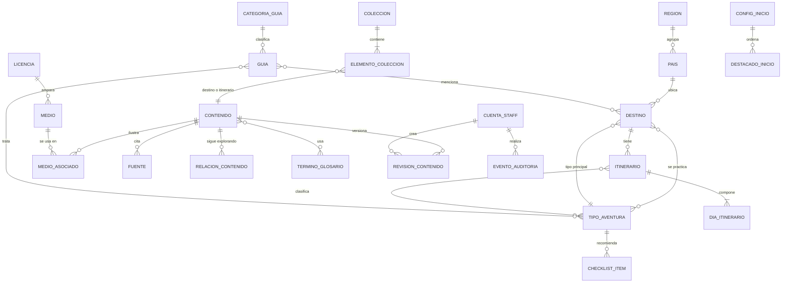

# BLUEPRINT FUNCIONAL DEL PRODUCTO — "Brújula Salvaje" (nombre provisional, DEC-AUTO-001)

| Campo | Valor |
|---|---|
| Documento | Blueprint Funcional / Master PRD v1.0 |
| Ticket | TKT-F3-001 (fase F3) |
| Fecha | 2026-09-25 |
| Productor | skill_arquitecto_funcional (subagente) |
| Input | `docs/01_requerimientos/PRD.md` + `docs/01_requerimientos/requirements.yaml` (51 REQ, 60 AC, DEC-AUTO-001..034) |
| Consumidores | Skill_UI_UX, Skill_Base_datos, Skill_Backend (contrato), Skill_Frontend (estándar), Skill_Developer, Skill_QA |
| Estado | PROPOSED. La autoridad de aprobación es el Orquestador (Autoridad Delegada, CLAUDE.md §0.2) |
| Stack | NO fijado aquí. Este documento describe capacidades funcionales; la tecnología se fija en F5 |

> **Convención de origen** (CLAUDE.md §0.2):
> - `[U]` = requisito del usuario (respuesta literal de la Entrevista Pública).
> - `[F2]` = expansión autónoma ya registrada en F2 (DEC-AUTO-001..034).
> - `[BP]` = funcionalidad NECESARIA derivada por este Blueprint para que un REQ funcione (skill §54.1), con traza al REQ que la exige y, si implica elegir entre alternativas, con DEC-AUTO-035..051.
> - `[EXP]` = expansión de valor añadido (skill §54.2), prioridad COULD, con DEC-AUTO-053..056. **No es requisito del usuario.**
>
> Las DEC-AUTO de este documento llevan `ORIGEN: EXPANSIÓN_AUTÓNOMA`, están en estado PROPOSED y son reversibles (Anexo B).

---

## 1. Resumen del Producto

Portal web editorial público, de solo lectura y en español, sobre viajes de aventura. Su propósito es **inspirar a explorar** `[U P3, P8]`. El visitante navega sin cuenta y sin entregar datos personales `[U P6, P10]` por una red interconectada de contenidos:

**Destinos** (≥20 reales, `[U P13]`) ↔ **Itinerarios** día a día `[U P1]` ↔ **Guías expertas** `[U P1]` ↔ **Tipos de aventura** `[F2]` ↔ **Colecciones** y **¿Dónde ir cada mes?** `[F2, Should]`.

Esa red se recorre con buscador interno, filtros facetados, un mapa con cartografía local y bloques "Sigue explorando". Un **panel editorial interno** `[F2 DEC-AUTO-005]`, solo para staff, mantiene todo el contenido y los medios sin tocar código. Toda la operación es local y sin terceros `[U P12]`.

## 2. Objetivo

| ID | Objetivo funcional | Cómo lo materializa el Blueprint |
|---|---|---|
| OBJ-001 | Inspirar a explorar | Flujo troncal FLOW-001 sin callejones sin salida. Cada página de contenido tiene ≥3 enlaces relacionados (RULE-006) y hay 0 páginas huérfanas (RULE-030, SCR-022) |
| OBJ-002 | Contenido experto y creíble | Metadatos de credibilidad obligatorios para publicar (RULE-002..004, RULE-009, RULE-010) y la página de Metodología (SCR-020) |
| OBJ-003 | Servir a todo tipo de visitantes | Todo el sitio público es anónimo (CON-001), cumple WCAG 2.2 AA (CON-008) y ofrece alternativas accesibles (lista del mapa, galería por teclado) |

## 3. Complejidad

**MEDIO.** Motivos: 2 superficies (sitio público y panel editorial), 3 roles, 14 módulos, un flujo de publicación con estados y validaciones, gestión de medios con licencias, auditoría y requisitos regulatorios (Ley 1581, derechos de autor). No es COMPLEJO porque no hay pagos, integraciones externas, workflows multi-aprobación ni multi-tenant. Por tanto, el límite de §54 es de **máximo 5 EXP**; se registran 4.

## 4. Actores

| ID | Actor | Tipo | Descripción | Origen |
|---|---|---|---|---|
| ACT-001 | Visitante | Humano, anónimo | Cualquier persona que navega el sitio público. No tiene cuenta ni se identifica | [U P5, P6] |
| ACT-002 | Editor | Humano, staff | Crea, edita, publica y retira contenido y medios | [F2 DEC-AUTO-005] + DEC-AUTO-035 |
| ACT-003 | Administrador editorial | Humano, staff | Tiene los permisos del Editor y además gestiona cuentas, auditoría, configuración del sitio, licencias, escalas y páginas legales | [BP] DEC-AUTO-035 |
| ACT-004 | Sistema | Automático | Procesa medios, completa relacionados, purga registros y anonimiza cuentas, y genera sitemap.xml | [BP] |
| ACT-005 | Operador técnico | Humano, fuera de la UI | Arranca el entorno, crea el primer Administrador por procedimiento operativo y ejecuta copias y restauraciones (F6/F9, DevOps) | [BP] DEC-AUTO-036, REQ-054 |
| ACT-006 | Rastreador de buscadores | Sistema externo pasivo | Consume sitemap.xml, robots.txt y metadatos. No es una integración: el sitio no le hace ninguna llamada | [F2] REQ-026 |
| ACT-007 | Actor malicioso | Amenaza | Actor externo anónimo o cuenta de staff comprometida (§40) | skill §56 |

## 5. Roles

| Rol | Actores | Autenticación | Alcance |
|---|---|---|---|
| ROL-VISITANTE | ACT-001 | Ninguna (CON-001) | Solo el contenido PUBLICADO del sitio público |
| ROL-EDITOR | ACT-002 | Usuario + contraseña; MFA TOTP opcional (Should) | Panel: contenido, medios, destacados y taxonomías editoriales. No toca cuentas, auditoría, configuración del sitio, licencias, escalas ni páginas legales |
| ROL-ADMINISTRADOR | ACT-003 | Usuario + contraseña; MFA TOTP obligatorio cuando se implemente (Should, DEC-AUTO-037) | Todo lo del Editor más la administración (§12) |

No existe ningún rol público autenticado (REQ-002). Siempre debe haber ≥1 Administrador activo (RULE-015).

## 6. Objetivos por Rol

| Rol | Objetivos |
|---|---|
| Visitante | Inspirarse (inicio, galerías). Descubrir por sí mismo (filtros, búsqueda, mapa, meses, colecciones, relacionados). Planear (itinerarios, guías, checklist, versión imprimible). Guardar sus favoritos sin cuenta (Could) |
| Editor | Mantener y ampliar el catálogo con calidad garantizada: el sistema impide publicar contenido incompleto, sin licencia o sin revisión. Configurar la portada. Previsualizar antes de publicar |
| Administrador | Controlar quién accede. Detectar y revertir abusos (auditoría, revisiones). Mantener los textos legales y la configuración de marca. Cumplir la retención (REQ-057, REQ-070) |

## 7. Dominios Funcionales

| ID | Dominio | Módulos |
|---|---|---|
| DOM-001 | Descubrimiento público | MOD-001, MOD-002, MOD-003, MOD-004, MOD-005, MOD-006 |
| DOM-002 | Institucional, cumplimiento y descubribilidad técnica | MOD-007, MOD-008 |
| DOM-003 | Gestión editorial (panel) | MOD-009, MOD-010, MOD-011, MOD-012, MOD-013 |
| DOM-004 | Operación | MOD-014 (sin pantallas; capacidades no funcionales) |

## 8. Módulos

| ID | Módulo | Propósito | Usuarios | Funcionalidades | Pantallas | Reglas clave |
|---|---|---|---|---|---|---|
| MOD-001 | Inicio y navegación global | Punto de entrada inspiracional y estructura de navegación | Visitante | FEAT-001, 002, 025, 026, 028, 051 | SCR-001, 022, 023, 024, 025 | RULE-016, 030 |
| MOD-002 | Exploración de destinos | Descubrir destinos por listado, filtros, mapa y mes | Visitante | FEAT-003, 004, 005, 018 | SCR-002, 003, 015, 016 | RULE-001, 011, 019 |
| MOD-003 | Contenido de aventura | Presentar destino, itinerario, tipo y guía, con su contenido relacionado | Visitante | FEAT-006..015, 022, 052 | SCR-004..012 | RULE-002..010, 025 |
| MOD-004 | Búsqueda | Encontrar contenido por texto | Visitante | FEAT-016 | SCR-017 | RULE-018 |
| MOD-005 | Colecciones y glosario | Curaduría temática y vocabulario experto | Visitante | FEAT-017, 019 | SCR-013, 014, 018 | RULE-024, 026 |
| MOD-006 | Herramientas del visitante (en el cliente) | Guardar y compartir sin cuenta ni envío de datos | Visitante | FEAT-020, 021 | SCR-019 (+ acciones contextuales) | RULE-013 |
| MOD-007 | Institucional y legal | Transparencia editorial, privacidad, cookies, aviso legal y créditos | Visitante, Admin (edición) | FEAT-023, 024 | SCR-020, 021 | RULE-005, 014 |
| MOD-008 | SEO técnico | Indexabilidad, metadatos y datos estructurados | Rastreador | FEAT-027 | Todas las públicas (transversal) | RULE-028 |
| MOD-009 | Acceso al panel | Autenticación, sesión, MFA, credenciales propias y autorización de tratamiento | Editor, Admin | FEAT-029..032 | SCR-030..033, 048 | RULE-017, 029 |
| MOD-010 | Gestión de contenido | CRUD editorial, vista previa, publicación, retiro, revisiones y relaciones | Editor, Admin | FEAT-033..040, 049, 050 | SCR-034..038 | RULE-001..012, 020..027 |
| MOD-011 | Medios | Subida segura, catalogación con licencia y créditos | Editor, Admin | FEAT-041, 042 | SCR-039, 040, 041 | RULE-005, 021 |
| MOD-012 | Configuración editorial | Destacados de inicio, taxonomías, catálogos y configuración del sitio | Editor (parcial), Admin | FEAT-043, 044, 047 | SCR-042, 043, 047 | RULE-014, 016 |
| MOD-013 | Cuentas y auditoría | Ciclo de vida de las cuentas del staff y trazabilidad de acciones | Admin | FEAT-045, 046 | SCR-044, 045, 046 | RULE-015, 017 |
| MOD-014 | Operación | Salud, registros sin PII, copias y restauración | Sistema, Operador | FEAT-048 | — | RULE-029 |

## 9. Funcionalidades

Prioridades: MUST / SHOULD / COULD (skill §8). "Errores" lista solo los funcionalmente relevantes.

| ID | Funcionalidad (acción → resultado) | Mód. | Actor | Precondición | Errores relevantes | Prior. | REQ | Origen |
|---|---|---|---|---|---|---|---|---|
| FEAT-001 | Ver inicio inspiracional: bloque principal, ≥6 destinos, todos los tipos publicados, ≥3 itinerarios, ≥3 guías, accesos a explorar/buscar/mapa/meses/colecciones | MOD-001 | Visitante | — | Destacados insuficientes → relleno automático (RULE-016) | MUST | 001, 010 | [U]+[F2] |
| FEAT-002 | Navegación global: cabecera (menú principal + búsqueda + guardados), pie (institucional/legal) y migas de pan en los detalles | MOD-001 | Visitante | — | — | MUST | 021 | [F2] |
| FEAT-003 | Listar destinos publicados (tarjeta: imagen, nombre, país, tipos, dificultad), 24 por página, orden A-Z o por dificultad | MOD-002 | Visitante | — | Página fuera de rango → 404 | MUST | 011 | [U] |
| FEAT-004 | Filtrar destinos por tipo, región, país, dificultad (rango), mes, duración (tramos) y presupuesto; el estado queda en la URL; se muestra el número de resultados | MOD-002 | Visitante | — | Sin resultados → estado vacío con sugerencias; parámetro inválido → se ignora | MUST | 014 | [F2]+DEC-AUTO-047 |
| FEAT-005 | Mapa del mundo con un marcador por destino; al activarlo, mini-tarjeta y navegación a la ficha; lista alternativa agrupada por región | MOD-002 | Visitante | — | Destino sin coordenadas → no publicable (RULE-023) | SHOULD | 018 | [F2] |
| FEAT-006 | Ver ficha de destino con todos los campos de PRD §6.2, sus itinerarios, guías, tipos y "Sigue explorando" | MOD-003 | Visitante | Destino PUBLICADO | Inexistente → 404; retirado → 410 | MUST | 012, 042 | [U]+[F2] |
| FEAT-007 | Galería ampliada: abrir, navegar anterior/siguiente y cerrar con ratón, táctil y teclado (Esc); muestra alt, pie y crédito | MOD-003 | Visitante | ≥3 medios | Imagen que no carga → alt + crédito visibles | MUST | 019 | [F2] |
| FEAT-008 | Ver itinerario día a día (duración, dificultad, resumen, días con actividades, distancia/desnivel, alojamiento orientativo, consejos, riesgos) con enlace al destino | MOD-003 | Visitante | Itinerario y destino PUBLICADOS | 404/410 | MUST | 016 | [U]+[F2] |
| FEAT-009 | Listar itinerarios publicados (24 por página, orden A-Z o por duración) | MOD-003 | Visitante | — | — | MUST | 016, 020 | [BP] |
| FEAT-010 | Explorar tipos de aventura: índice y detalle (descripción, nivel de exigencia, destinos asociados, guías relacionadas) | MOD-003 | Visitante | ≥1 destino por tipo | — | MUST | 013 | [F2] |
| FEAT-011 | Checklist de equipo del tipo de aventura (≥8 elementos, agrupados, esenciales marcados) | MOD-003 | Visitante | — | Tipo sin checklist → sección oculta | SHOULD | 029 | [F2] |
| FEAT-012 | Guías expertas: índice por categoría, página de categoría y detalle con destinos y tipos relacionados | MOD-003 | Visitante | — | Categoría vacía → no se lista | MUST | 017 | [U]+[F2] |
| FEAT-013 | Bloque "Sigue explorando": ≥3 contenidos publicados (curados + complemento automático por afinidad) | MOD-003 | Visitante / Sistema | — | — | MUST | 020 | [F2]+DEC-AUTO-042 |
| FEAT-014 | Mostrar autoría ("Equipo editorial {marca}"), fecha de última revisión (es-CO) y fuentes o enlace a la Metodología | MOD-003 | Visitante | — | — | MUST | 023 | [F2]+DEC-AUTO-039 |
| FEAT-015 | Mostrar dificultad (escala 1-5 con enlace a su definición), riesgos y recomendaciones de seguridad, y el descargo de responsabilidad | MOD-003 | Visitante | — | — | MUST | 024 | [F2] |
| FEAT-016 | Buscar texto (insensible a tildes y mayúsculas) en destinos, itinerarios, guías y tipos; resultados agrupados por tipo | MOD-004 | Visitante | 2..100 caracteres | Sin coincidencias → estado vacío; entrada inválida → mensaje en línea | MUST | 015 | [F2]+DEC-AUTO-048 |
| FEAT-017 | Colecciones curadas: índice y detalle con ≥4 elementos (destinos/itinerarios) y nota editorial | MOD-005 | Visitante | — | Elemento retirado → se oculta | SHOULD | 027 | [F2] |
| FEAT-018 | ¿Dónde ir cada mes?: índice de 12 meses y listado de los destinos cuya mejor época incluye ese mes | MOD-002 | Visitante | — | Mes sin destinos → estado vacío con meses adyacentes | SHOULD | 028 | [F2] |
| FEAT-019 | Glosario alfabético con anclas por término, enlazado desde los contenidos | MOD-005 | Visitante | — | — | COULD | 032 | [F2] |
| FEAT-020 | Guardar/quitar destinos e itinerarios solo en el navegador; ver la lista en "Mis aventuras guardadas" | MOD-006 | Visitante | Almacenamiento local disponible | No disponible → acción deshabilitada con explicación | COULD | 030 | [F2] |
| FEAT-021 | Compartir: función nativa del dispositivo o copiar la URL canónica | MOD-006 | Visitante | — | Sin función nativa → copiar; fallo al copiar → mostrar la URL seleccionable | COULD | 031 | [F2] |
| FEAT-022 | Versión imprimible de itinerario y checklist (sin navegación, contenido completo) | MOD-003 | Visitante | — | — | COULD | 033 | [F2] |
| FEAT-023 | Páginas institucionales: Acerca de / Metodología editorial (incluye escalas de dificultad y presupuesto), Política de Tratamiento de la Información, Política de cookies, Aviso legal / Términos | MOD-007 | Visitante | — | Responsable sin definir → marcador visible `[RESPONSABLE POR DEFINIR]` | MUST | 025, 070 | [F2] |
| FEAT-024 | Créditos de imágenes: listado de todos los medios usados en contenido publicado, con autor, licencia (enlace) y fuente | MOD-007 | Visitante | — | — | MUST | 043, 071, 025 | [F2] |
| FEAT-025 | Mapa del sitio HTML con todas las páginas publicadas agrupadas por sección | MOD-001 | Visitante | — | — | MUST | 021, 020 | [F2] |
| FEAT-026 | Páginas de error propias: 404, 410 (retirado) y 500, con rutas de salida | MOD-001 | Visitante | — | — | MUST | 021, 012, 022 | [F2]+DEC-AUTO-040 |
| FEAT-027 | SEO técnico: title/description únicos, canónica, Open Graph, schema.org por tipo, sitemap.xml, robots.txt, contenido principal presente en la respuesta HTML inicial | MOD-008 | Rastreador | — | — | MUST | 026 | [F2] |
| FEAT-028 | Aviso de estado sin conexión: el contenido cargado permanece y las acciones de red ofrecen "Reintentar" | MOD-001 | Visitante, staff | — | — | MUST | 060, 056 (skill §53.3) | [BP] |
| FEAT-029 | Iniciar y cerrar sesión en el panel, con limitación de intentos, expiración por inactividad y retorno seguro | MOD-009 | Editor, Admin | Cuenta ACTIVA o PENDIENTE_ACTIVACION | Credenciales inválidas (mensaje genérico); bloqueo temporal; sesión expirada | MUST | 022, 055 | [F2]+DEC-AUTO-049 |
| FEAT-030 | Segundo factor TOTP: activar (código QR/clave + códigos de recuperación), verificar al entrar y desactivar | MOD-009 | Editor, Admin | Sesión | Código inválido cuenta como intento fallido | SHOULD | 055 | [F2]+DEC-AUTO-037 |
| FEAT-031 | Gestionar credenciales propias: cambio de contraseña obligatorio tras alta o restablecimiento, y cambio voluntario | MOD-009 | Editor, Admin | Sesión | Contraseña débil o comprometida conocida → rechazo | MUST | 055, 022 | [BP] DEC-AUTO-036 |
| FEAT-032 | Registrar la autorización de tratamiento de datos del staff (fecha y versión de la política) en el primer acceso y cada vez que cambia la versión | MOD-009 | Editor, Admin | Sesión | Rechazar → cierre de sesión (sin acceso al panel) | MUST | 070 | [BP] DEC-AUTO-038 |
| FEAT-033 | Tablero y listado de contenidos por tipo, con filtros (estado, texto) y orden por última modificación | MOD-010 | Editor, Admin | Sesión | — | MUST | 022 | [F2] |
| FEAT-034 | Crear y editar contenido de cualquier tipo (destino, itinerario con días, guía, tipo con checklist, colección, término, página institucional), con validación de formato al guardar | MOD-010 | Editor, Admin (páginas legales solo Admin) | Sesión | Conflicto de versión; sesión expirada; datos inválidos | MUST | 022, 042 | [F2] |
| FEAT-035 | Vista previa del estado actual del formulario con la plantilla pública, sin persistir; marcada BORRADOR/NO PUBLICADO y con noindex | MOD-010 | Editor, Admin | Sesión | — | MUST | 022 | [F2]+DEC-AUTO-045 |
| FEAT-036 | Publicar o actualizar la publicación con validación completa (campos obligatorios, medios con licencia, ≥3 relacionados, fecha de revisión) | MOD-010 | Editor, Admin | Contenido guardado | Validación fallida → lista de errores enlazada a los campos | MUST | 022, 023, 042, 043 | [F2] |
| FEAT-037 | Retirar contenido (motivo obligatorio, análisis de impacto, cascada destino → itinerarios) y reactivarlo como borrador | MOD-010 | Editor, Admin | PUBLICADO / RETIRADO | Dependencia bloqueante (RULE-007) | MUST | 022, 057 | [F2]+DEC-AUTO-045 |
| FEAT-038 | Eliminar definitivamente un borrador que nunca se publicó | MOD-010 | Editor, Admin | BORRADOR sin publicación previa | — | MUST | 022 | [BP] DEC-AUTO-045 |
| FEAT-039 | Gestionar las relaciones curadas ("Sigue explorando") y los términos de glosario vinculados a un contenido | MOD-010 | Editor, Admin | — | Autorrelación o duplicado → rechazo | MUST | 020, 032 | [BP] |
| FEAT-040 | Consultar el historial de revisiones (instantáneas por publicación, actualización y retiro) de un contenido | MOD-010 | Editor, Admin | — | — | MUST | 057, 022 | [BP] DEC-AUTO-045 |
| FEAT-041 | Subir imágenes (1..10 por operación) con validación por contenido, re-codificación, eliminación de metadatos, derivados responsivos y detección de duplicados | MOD-011 | Editor, Admin | Sesión | Formato no permitido, tamaño excedido, archivo corrupto o duplicado | MUST | 019, 043, 061 | [BP] DEC-AUTO-044 |
| FEAT-042 | Catalogar un medio: texto alternativo, pie, autor/crédito, fuente y licencia; retirarlo si no está en uso | MOD-011 | Editor, Admin | Medio subido | Licencia incompatible; medio en uso | MUST | 043, 071 | [F2] |
| FEAT-043 | Configurar los destacados del inicio (bloque principal, destinos, itinerarios, guías), con orden y mínimos | MOD-012 | Editor, Admin | Contenido publicado | Por debajo del mínimo → rechazo | MUST | 010 (AC-011) | [F2] |
| FEAT-044 | Gestionar taxonomías y catálogos: regiones, países y categorías de guía (Editor y Admin); licencias y escalas de dificultad/presupuesto (solo Admin) | MOD-012 | Editor, Admin | — | Elemento en uso por contenido publicado → no se puede retirar | MUST | 013, 014, 017, 024, 043 | [BP] (STN-007) |
| FEAT-045 | Gestionar cuentas del staff: alta con contraseña temporal, cambio de rol, restablecimiento de contraseña/MFA, desactivación, reactivación y anonimización | MOD-013 | Admin | — | Último Administrador (RULE-015) | MUST | 022, 055, 057, 070 | [BP] DEC-AUTO-035/036 |
| FEAT-046 | Registrar automáticamente cada acción del panel y consultar la auditoría con filtros (solo lectura) | MOD-013 | Sistema; Admin (consulta) | — | — | MUST | 022 (AC-030), 057 | [F2] DEC-AUTO-034 |
| FEAT-047 | Configuración del sitio: nombre de marca, lema, texto del descargo y datos del Responsable del tratamiento | MOD-012 | Admin | — | Datos del Responsable vacíos → marcador + alerta (GAP-004) | MUST | 025, 070, 024 | [BP] (RSK-003) |
| FEAT-048 | Operación: liveness/readiness, registros estructurados sin PII, copia diaria, restauración probada, purgas y anonimizaciones programadas | MOD-014 | Sistema, Operador | — | BD no disponible → readiness falla | MUST | 050, 054, 057, 063 | [F2] |
| FEAT-049 | Tablero de salud editorial: revisiones con más de 12 meses, medios sin catalogar o sin uso, colecciones/destacados bajo el mínimo, contenidos con <3 relacionados curados | MOD-010 | Editor, Admin | — | — | COULD | (valor para 020, RSK-006) | [EXP] EXP-001 |
| FEAT-050 | Restaurar una revisión anterior en el formulario (requiere publicar o actualizar para que surta efecto) | MOD-010 | Editor, Admin | Revisión existente | — | COULD | (valor para 022, RSK-005) | [EXP] EXP-002 |
| FEAT-051 | "Sorpréndeme": abre un destino publicado al azar | MOD-001 | Visitante | ≥1 destino | — | COULD | (valor para 001, OBJ-001) | [EXP] EXP-003 |
| FEAT-052 | Tiempo estimado de lectura en guías (derivado del número de palabras) | MOD-003 | Visitante | — | — | COULD | (valor para 017) | [EXP] EXP-004 |

## 10. Sitemap

```
BRÚJULA SALVAJE
│
├── SITIO PÚBLICO (anónimo, solo contenido PUBLICADO; cabecera + pie en todas las páginas)
│   ├── /                                   SCR-001 Inicio
│   ├── /destinos                           SCR-002 Explorar destinos (listado + filtros)
│   │   ├── /destinos/mapa                  SCR-003 Mapa de destinos            [SHOULD]
│   │   └── /destinos/{slug}                SCR-004 Ficha de destino
│   │        └── (modal)                    SCR-005 Visor de galería
│   ├── /itinerarios                        SCR-006 Listado de itinerarios
│   │   └── /itinerarios/{slug}             SCR-007 Detalle de itinerario (+ impresión) 
│   ├── /tipos-de-aventura                  SCR-008 Índice de tipos
│   │   └── /tipos-de-aventura/{slug}       SCR-009 Detalle de tipo (+ checklist, impresión)
│   ├── /guias                              SCR-010 Índice de guías por categoría
│   │   ├── /guias/categoria/{slug}         SCR-011 Categoría de guías
│   │   └── /guias/{slug}                   SCR-012 Detalle de guía
│   ├── /colecciones                        SCR-013 Índice de colecciones        [SHOULD]
│   │   └── /colecciones/{slug}             SCR-014 Detalle de colección         [SHOULD]
│   ├── /cuando-ir                          SCR-015 ¿Dónde ir cada mes?           [SHOULD]
│   │   └── /cuando-ir/{mes}                SCR-016 Destinos del mes (enero…diciembre) [SHOULD]
│   ├── /buscar?q=…                         SCR-017 Resultados de búsqueda
│   ├── /glosario (#{termino})              SCR-018 Glosario                     [COULD]
│   ├── /guardados                          SCR-019 Mis aventuras guardadas      [COULD]
│   ├── /acerca-de                          SCR-020 Acerca de / Metodología editorial (#escala-de-dificultad, #escala-de-presupuesto)
│   ├── /politica-de-tratamiento-de-datos   SCR-020 (plantilla institucional)
│   ├── /politica-de-cookies                SCR-020 (plantilla institucional)
│   ├── /aviso-legal                        SCR-020 (plantilla institucional)
│   ├── /creditos                           SCR-021 Créditos de imágenes
│   ├── /mapa-del-sitio                     SCR-022 Mapa del sitio HTML
│   ├── (cualquier ruta inexistente)        SCR-023 Error 404
│   ├── (contenido retirado)                SCR-024 Contenido retirado (HTTP 410)
│   ├── (fallo del servidor)                SCR-025 Error 500
│   └── Recursos técnicos (no son pantallas): /sitemap.xml, /robots.txt, derivados de imágenes, cartografía local
│
│   Componentes globales (GLOBAL INTERACTION, no son SCR):
│   GI-01 Cabecera (Destinos, Tipos de aventura, Itinerarios, Guías, Colecciones*, Cuándo ir*, búsqueda, Guardados*)
│   GI-02 Pie (Acerca de/Metodología, Tratamiento de datos, Cookies, Aviso legal, Créditos, Mapa del sitio, Glosario*)
│   GI-03 Migas de pan (en los detalles)    GI-04 Aviso sin conexión    GI-05 Descargo de responsabilidad
│   GI-06 Acción Compartir*   GI-07 Acción Guardar*   GI-08 Acción Sorpréndeme* (EXP-003)
│   (* solo se muestra si la funcionalidad está implementada, RULE-030)
│
└── PANEL EDITORIAL (/panel/**; sin enlace desde el sitio público; noindex por cabecera; sesión obligatoria)
    ├── /panel/acceso                       SCR-030 Acceso
    │   └── /panel/acceso/verificacion      SCR-031 Verificación MFA            [SHOULD]
    ├── /panel/autorizacion                 SCR-033 Autorización de tratamiento (bloqueante en el primer acceso)
    ├── /panel/cuenta                       SCR-032 Mi cuenta (contraseña, MFA)
    ├── /panel                              SCR-034 Tablero
    ├── /panel/contenido/{tipo}             SCR-035 Listado de contenidos
    │   │   tipo ∈ destinos, itinerarios, guias, tipos-de-aventura, colecciones, glosario, paginas
    │   ├── /panel/contenido/{tipo}/nuevo   SCR-036 Editor de contenido (alta)
    │   ├── /panel/contenido/{tipo}/{id}    SCR-036 Editor de contenido (edición + historial)
    │   │    ├── (pestaña/vista)            SCR-037 Vista previa
    │   │    ├── (diálogo)                  SCR-038 Publicar / Actualizar / Retirar / Eliminar
    │   │    └── (modal)                    SCR-041 Selector de medios
    ├── /panel/medios                       SCR-039 Biblioteca de medios (+ subida)
    │   └── /panel/medios/{id}              SCR-040 Detalle de medio
    ├── /panel/inicio                       SCR-042 Destacados de inicio
    ├── /panel/taxonomias                   SCR-043 Taxonomías y catálogos
    ├── /panel/usuarios                     SCR-044 Cuentas del equipo            [Admin]
    │   └── /panel/usuarios/{id} | nuevo    SCR-045 Formulario de cuenta          [Admin]
    ├── /panel/auditoria                    SCR-046 Registro de auditoría         [Admin]
    ├── /panel/configuracion                SCR-047 Configuración del sitio       [Admin]
    └── (sin permiso)                       SCR-048 Acceso denegado (403)
```

Las URL públicas están en español, en minúsculas y con guiones (DEC-AUTO-046). El `{slug}` sigue el patrón `[a-z0-9]+(-[a-z0-9]+)*`, tiene ≤120 caracteres y es único por tipo.

## 11. Inventario de Pantallas

**Estados estándar** (skill §53.3). Cada SCR declara solo lo que se desvía del estándar o lo concreta:
- **ST-LOADING**: marcador de estructura (esqueleto) sin saltos de maquetación (CLS ≤0,1). En las rutas públicas, el contenido principal llega en la respuesta inicial (CON-007), así que Loading solo aplica a navegaciones internas y a acciones asíncronas.
- **ST-EMPTY**: mensaje explicativo más ≥2 rutas de salida. Nunca una pantalla en blanco.
- **ST-ERROR**: mensaje comprensible, acción "Reintentar" y enlace a Inicio (panel: a Tablero). Nunca se muestran trazas técnicas.
- **ST-OFFLINE**: aviso global GI-04 "Sin conexión". El contenido ya mostrado sigue legible; filtros, búsqueda, paginación y guardado del panel quedan en espera con "Reintentar". En el panel, los datos del formulario no se pierden.
- **ST-NOTFOUND / ST-GONE**: SCR-023 / SCR-024.
- **ST-UNAUTHORIZED** (panel): redirección a SCR-030 con retorno seguro. **ST-FORBIDDEN**: SCR-048.

### 11.1 Sitio público

**SCR-001 — Inicio** · PAGE · `/` · MOD-001 · Visitante · MUST · REQ-001, 010, 020 · FEAT-001, 002, 051
- Propósito: inspirar y distribuir hacia todas las vías de exploración.
- Muestra: bloque principal inspiracional (titular, subtítulo, imagen, CTA "Explorar destinos"); ≥6 destinos destacados (tarjeta de destino); todos los tipos de aventura publicados; ≥3 itinerarios; ≥3 guías; accesos a Mapa*, Cuándo ir*, Colecciones* y Sorpréndeme*; campo de búsqueda.
- Acciones: abrir un destino, tipo, itinerario o guía; ir a Explorar; buscar; Sorpréndeme (EXP-003).
- Entrada: URL directa, logo desde cualquier página, errores. Salida: SCR-002, 003, 004, 007, 009, 012, 013, 015, 017.
- Datos: DATA-021, DATA-022, DATA-005, DATA-003, DATA-006, DATA-009.
- Estados: EMPTY por sección → si faltan destacados, relleno automático (RULE-016); si no hay nada publicado (solo en un entorno vacío) → mensaje "Contenido en preparación" + enlaces institucionales. ERROR/OFFLINE estándar.

**SCR-002 — Explorar destinos** · LIST · `/destinos?tipo=&region=&pais=&dificultad_min=&dificultad_max=&mes=&duracion=&presupuesto=&orden=&pagina=` · MOD-002 · MUST · REQ-011, 014 · FEAT-003, 004, 020, 021
- Muestra: panel de filtros (tipo multiselección, región, país dependiente de la región, dificultad 1-5 como rango, mes, tramos de duración 1-3/4-7/8-14/15+ días, presupuesto 1-4), filtros activos como fichas quitables, "Limpiar filtros", número de resultados, orden (A-Z por defecto / dificultad ascendente / descendente), rejilla de tarjetas y paginación (24).
- Acciones: aplicar o quitar filtros (la URL se actualiza y es compartible), ordenar, paginar, abrir un destino, ver en mapa (SCR-003), Guardar* en la tarjeta.
- Entrada: cabecera, inicio, fichas de tipo (con el filtro tipo preaplicado), región o país en la ficha. Salida: SCR-004, 003.
- Estados: EMPTY → "Ningún destino cumple estos filtros", sugerencia de quitar el último filtro, lista de tipos y enlace a Limpiar filtros (AC-018). Parámetro inválido → se ignora y se muestra el resultado sin él (AC-113). Página fuera de rango → SCR-023.

**SCR-003 — Mapa de destinos** · FULLSCREEN/PAGE · `/destinos/mapa` · MOD-002 · SHOULD · REQ-018 · FEAT-005
- Muestra: mapa del mundo con cartografía local (sin teselas externas), un marcador por destino publicado, mini-tarjeta al activar un marcador (nombre, país, dificultad, enlace) y **lista alternativa** equivalente agrupada por región (siempre disponible en la misma página).
- Acciones: activar un marcador (ratón, táctil o teclado, en orden lógico región → nombre), ir a la ficha, cambiar a la lista, ir al listado con filtros.
- Estados: si la cartografía no carga → se muestra solo la lista con aviso. OFFLINE estándar.

**SCR-004 — Ficha de destino** · DETAIL · `/destinos/{slug}` · MOD-003 · MUST · REQ-012, 019, 020, 023, 024, 042, 026 · FEAT-006, 007, 013, 014, 015, 020, 021
- Muestra (orden funcional): migas (Inicio › Destinos › {Destino}); nombre, país, región; resumen inspiracional; datos clave (dificultad con enlace a la escala, mejor época en meses, duración recomendada, presupuesto 1-4 con enlace a la escala, clima, altitud si aplica); galería (≥3); descripción experta; cómo llegar; seguridad y riesgos; sostenibilidad; ubicación (coordenadas + enlace a SCR-003 centrado); tipos de aventura (enlaces a SCR-009); itinerarios del destino (SCR-007); guías relacionadas (SCR-012); fuentes; autoría y fecha de revisión; descargo (GI-05); "Sigue explorando" (≥3); Compartir* y Guardar*.
- Entrada: SCR-001, 002, 003, 009, 014, 016, 017, 019, relacionados. Salida: SCR-005, 007, 009, 012, 002 (filtros por región o país), 004 (relacionados), 020.
- Estados: destino sin itinerarios → la sección muestra "Aún no hay itinerario para este destino" + itinerarios de destinos afines + enlace a SCR-006 (nunca vacía sin salida). NOTFOUND/GONE → SCR-023/024.

**SCR-005 — Visor de galería** · MODAL · (dentro de SCR-004) · MUST · REQ-019, 056 · FEAT-007
- Muestra: imagen ampliada, alt, pie, crédito (autor + licencia) y posición "n de N".
- Acciones: anterior/siguiente (flechas y botones), cerrar (Esc, botón o clic fuera). El foco queda atrapado dentro y vuelve a la miniatura al cerrar.
- Estados: la imagen no carga → alt + crédito + "Reintentar".

**SCR-006 — Listado de itinerarios** · LIST · `/itinerarios?orden=&pagina=` · MUST · REQ-016, 020 · FEAT-009
- Muestra: tarjetas (título, destino, duración, dificultad, imagen), orden A-Z / duración, paginación (24).
- Estados: EMPTY → enlace a Destinos y Guías.

**SCR-007 — Detalle de itinerario** · DETAIL · `/itinerarios/{slug}` · MUST · REQ-016, 020, 023, 024, 033 · FEAT-008, 013, 014, 015, 020, 021, 022
- Muestra: migas (Inicio › Destinos › {Destino} › {Itinerario}); título; destino (enlace); duración; dificultad; tipos; resumen; distancia y desnivel totales si aplican; una sección por día (título, actividades, distancia, desnivel +/−, alojamiento orientativo, consejos); riesgos y seguridad; fuentes; autoría/revisión; descargo; "Sigue explorando" (≥3); Imprimir*; Compartir*; Guardar*.
- Salida: SCR-004 (destino), SCR-009, SCR-012, relacionados.
- Estados: NOTFOUND/GONE. Si el destino fue retirado, el itinerario también está retirado (RULE-007).

**SCR-008 — Índice de tipos de aventura** · LIST · `/tipos-de-aventura` · MUST · REQ-013 · FEAT-010
- Muestra: todos los tipos publicados (nombre, imagen, nivel de exigencia y número de destinos).

**SCR-009 — Detalle de tipo de aventura** · DETAIL · `/tipos-de-aventura/{slug}` · MUST · REQ-013, 020, 029, 024 · FEAT-010, 011, 013, 015, 022
- Muestra: migas; descripción; nivel de exigencia (1-5); destinos asociados (tarjetas, enlace "Ver todos en Explorar" con `?tipo=` preaplicado); checklist de equipo* (grupos, marca de esencial, Imprimir*); guías relacionadas; descargo; "Sigue explorando".

**SCR-010 — Índice de guías** · LIST · `/guias` · MUST · REQ-017 · FEAT-012
- Muestra: las categorías con ≥1 guía publicada, cada una con sus guías más recientes (hasta 4) y un enlace a la categoría.

**SCR-011 — Categoría de guías** · LIST · `/guias/categoria/{slug}` · MUST · REQ-017 · FEAT-012
- Muestra: descripción de la categoría y guías (título, resumen, fecha de revisión, tiempo de lectura*), ordenadas por revisión descendente y paginadas (24). Otras categorías.
- Estados: una categoría sin guías publicadas no se enlaza en ningún sitio. Si se accede directamente → SCR-023.

**SCR-012 — Detalle de guía** · DETAIL · `/guias/{slug}` · MUST · REQ-017, 020, 023, 024 · FEAT-012, 013, 014, 015, 021, 052
- Muestra: migas (Inicio › Guías › {Categoría} › {Guía}); título; categoría; tiempo de lectura*; cuerpo; destinos y tipos relacionados; fuentes; autoría/revisión; descargo; "Sigue explorando".

**SCR-013 — Índice de colecciones** · LIST · `/colecciones` · SHOULD · REQ-027 · FEAT-017
**SCR-014 — Detalle de colección** · DETAIL · `/colecciones/{slug}` · SHOULD · REQ-027 · FEAT-017
- Muestra: descripción y elementos ordenados (destinos/itinerarios) con nota editorial. Los elementos no publicados se omiten (RULE-024).

**SCR-015 — ¿Dónde ir cada mes?** · LIST · `/cuando-ir` · SHOULD · REQ-028 · FEAT-018
- Muestra: 12 meses con el número de destinos y un destacado por mes.

**SCR-016 — Destinos del mes** · LIST · `/cuando-ir/{mes}` (mes en español, minúsculas) · SHOULD · REQ-028 · FEAT-018
- Muestra: los destinos cuya mejor época incluye el mes (AC-036), navegación al mes anterior o siguiente y un enlace a Explorar con `?mes=`.
- Estados: EMPTY → meses adyacentes con destinos. Un mes inválido → SCR-023.

**SCR-017 — Resultados de búsqueda** · LIST · `/buscar?q=&tipo=&pagina=` · MUST · REQ-015 · FEAT-016
- Muestra: la consulta (como texto), el total y grupos Destinos / Itinerarios / Guías / Tipos (hasta 10 por grupo, "Ver todos" → `&tipo=`, paginado de 24).
- Validación: q de 2 a 100 caracteres. Fuera de rango → mensaje en línea sin ejecutar la búsqueda (AC-020).
- Estados: EMPTY → "Sin resultados para «q»", sugerencias (tipos de aventura, destinos destacados, enlace a Explorar). Página marcada noindex.

**SCR-018 — Glosario** · LIST · `/glosario` · COULD · REQ-032 · FEAT-019
- Muestra: índice alfabético A-Z, términos con ancla `#{slug}` y definición, y los contenidos que usan cada término.

**SCR-019 — Mis aventuras guardadas** · LIST · `/guardados` · COULD · REQ-030 · FEAT-020
- Muestra: los elementos guardados en este navegador (tipo, título, país) a partir de los datos almacenados localmente, **sin consultar al servidor** (RULE-013). Acciones: abrir, quitar, vaciar todo (con confirmación).
- Estados: EMPTY → "Aún no has guardado aventuras" + Explorar / Sorpréndeme*. Almacenamiento no disponible → explicación.

**SCR-020 — Página institucional** (plantilla) · PAGE · `/acerca-de`, `/politica-de-tratamiento-de-datos`, `/politica-de-cookies`, `/aviso-legal` · MUST · REQ-025, 070, 024, 023 · FEAT-023
- `/acerca-de` incluye: propósito del sitio, Metodología editorial (cómo se redacta y revisa y que el contenido semilla lo generó el ecosistema, DEC-AUTO-033), **escala de dificultad 1-5** y **escala de presupuesto 1-4** (desde DATA-020, anclas enlazadas desde todas las fichas) y el descargo ampliado.
- Política de tratamiento: Responsable (desde DATA-023; si está vacío → `[RESPONSABLE POR DEFINIR]`), finalidades (cuentas del staff, registros técnicos), derechos del titular, canal de atención y versión/vigencia.
- Política de cookies: declara que el sitio público no usa cookies y que el panel usa solo cookies técnicas de sesión y CSRF.

**SCR-021 — Créditos de imágenes** · LIST · `/creditos` · MUST · REQ-043, 071 · FEAT-024
- Muestra: por cada medio usado en contenido publicado, una miniatura, el autor, la licencia (con enlace al texto legal), la fuente y el contenido donde aparece. Paginado u agrupado por contenido.

**SCR-022 — Mapa del sitio HTML** · PAGE · `/mapa-del-sitio` · MUST · REQ-021, 020 · FEAT-025
- Muestra: todas las páginas publicadas por sección (destinos por región, itinerarios, tipos, guías por categoría, colecciones, meses e institucionales). Garantiza que ninguna página quede huérfana (AC-025).

**SCR-023 — Error 404** · ERROR · HTTP 404 · MUST · REQ-021, 012 · FEAT-026
- Muestra: mensaje, búsqueda, enlaces a Inicio / Destinos / Guías, 3 destinos destacados y Sorpréndeme*.

**SCR-024 — Contenido retirado** · ERROR · HTTP 410 · MUST · REQ-022 (AC-028) · FEAT-026 · DEC-AUTO-040
- Muestra: "Este contenido ya no está disponible", ≥3 alternativas afines (mismo tipo o región), enlace al listado padre y, si el elemento está en Guardados*, la opción "Quitar de guardados" (local).

**SCR-025 — Error 500** · ERROR · HTTP 500 · MUST · REQ-021 · FEAT-026
- Muestra: mensaje sin detalles técnicos, "Reintentar" e Inicio. Funciona aunque los datos no estén disponibles (sin dependencias de contenido).

### 11.2 Panel editorial (todas: acceso con sesión; respuestas `no-store` y noindex, RULE-029)

**SCR-030 — Acceso** · FORM · `/panel/acceso?siguiente=` · MUST · REQ-022, 055 · FEAT-029
- Campos: usuario, contraseña. Acción: Entrar. Mensajes: credenciales inválidas (genérico, sin revelar si el usuario existe), cuenta bloqueada temporalmente (genérico + tiempo), sesión expirada y sesión cerrada.
- Salida: SCR-031 (MFA activo) → SCR-032 (debe cambiar la contraseña) → SCR-033 (falta autorización) → `siguiente` interno válido o SCR-034.
- Validación: `siguiente` solo acepta rutas relativas bajo `/panel/` (AC-115).

**SCR-031 — Verificación MFA** · FORM · SHOULD · FEAT-030
- Campos: código de 6 dígitos o código de recuperación. Los fallos cuentan para el bloqueo. "Volver" cierra el intento.

**SCR-032 — Mi cuenta** · FORM · `/panel/cuenta` · MUST · FEAT-031, 030
- Secciones: cambiar contraseña (actual, nueva y confirmación; política mínima RULE-017); MFA* (activar/desactivar, regenerar códigos); fecha y versión de la autorización otorgada. El modo "cambio obligatorio" no permite navegar a otras pantallas hasta completarlo.

**SCR-033 — Autorización de tratamiento** · PAGE (bloqueante) · `/panel/autorizacion` · MUST · REQ-070 · FEAT-032
- Muestra: resumen de la finalidad del tratamiento de los datos del staff y enlace a la política vigente (versión). Acciones: "Autorizo" (registra fecha y versión) o "No autorizo" (cierra la sesión y la cuenta sigue sin acceso).

**SCR-034 — Tablero** · DASHBOARD · `/panel` · MUST · REQ-022 · FEAT-033, 049
- Muestra: conteos por tipo y estado, últimos contenidos modificados, accesos rápidos (nuevo destino, subir medios, destacados) y el widget de salud editorial* (EXP-001). Para Admin: alerta si faltan datos del Responsable (GAP-004).

**SCR-035 — Listado de contenidos** · LIST · `/panel/contenido/{tipo}?estado=&q=&pagina=` · MUST · FEAT-033
- Columnas: título, estado, fecha de revisión, última modificación (quién y cuándo), publicado sí/no. Filtros: estado y texto. Orden: última modificación descendente. Paginación de 50. Acciones: Nuevo, Editar y "Ver en el sitio" (solo si está publicado).
- Estados: EMPTY → "Aún no hay {tipo}" + Nuevo.

**SCR-036 — Editor de contenido** · FORM (secciones) · `/panel/contenido/{tipo}/nuevo | {id}` · MUST · REQ-022, 042, 023, 024, 020 · FEAT-034..040, 050
- Barra de acciones según el estado (STATE-001): Guardar borrador · Vista previa · Publicar | Actualizar publicación · Retirar | Reactivar como borrador · Eliminar (solo borrador nunca publicado).
- Indicador de completitud para publicar (lista de requisitos pendientes, sin bloquear el guardado del borrador).
- Secciones por tipo (los campos están en §18):

| Tipo | Secciones |
|---|---|
| Destino | Identidad (nombre, slug, país) · Datos clave (tipos + principal, dificultad, meses, duración, presupuesto, clima, altitud) · Contenido experto (resumen, descripción) · Viaje (cómo llegar) · Seguridad y sostenibilidad · Ubicación (lat/long con vista previa del marcador) · Medios (portada, galería ≥3, SCR-041) · Relacionados y glosario · Fuentes · SEO · Revisión (fecha) · Historial |
| Itinerario | Identidad (título, slug, destino) · Datos (duración, dificultad, tipos, totales) · Resumen · Días (lista ordenable; el número de días debe coincidir con la duración) · Riesgos y seguridad · Medios · Relacionados/glosario · Fuentes · SEO · Revisión · Historial |
| Guía | Identidad (título, slug, categoría) · Resumen · Cuerpo · Destinos y tipos relacionados · Medios (portada) · Relacionados/glosario · Fuentes · SEO · Revisión · Historial |
| Tipo de aventura | Identidad · Descripción · Nivel de exigencia · Checklist (elementos ordenables) · Medios · Relacionados · SEO · Revisión · Historial |
| Colección | Identidad · Descripción · Elementos (destinos/itinerarios publicados, ordenables, nota) · Portada · SEO · Revisión · Historial |
| Término de glosario | Término, slug, definición y contenidos vinculados (solo lectura: se vinculan desde cada contenido) |
| Página institucional | Clave (fija), título, cuerpo, versión del documento y vigencia. Las páginas legales solo las edita el Admin |

- Estados: conflicto de versión → aviso "Otra persona guardó cambios" con "Recargar" (sin sobrescribir, AC-110); la sesión va a expirar → aviso 2 min antes con "Seguir conectado"; OFFLINE → guardar deshabilitado y los datos se conservan; al salir con cambios sin guardar → confirmación.

**SCR-037 — Vista previa** · FULLSCREEN · `/panel/contenido/{tipo}/{id}/vista-previa` · MUST · FEAT-035
- Renderiza la plantilla pública con los datos actuales del formulario (sin persistirlos) y una franja fija "VISTA PREVIA – NO PUBLICADO". Los enlaces a otros contenidos llevan a sus versiones públicas. Solo con sesión y noindex.

**SCR-038 — Diálogo de publicación/retiro** · DIALOG · MUST · FEAT-036, 037, 038
- Publicar / Actualizar: ejecuta la validación de publicación. Si falla, muestra una lista de errores enlazados al campo. Si pasa, muestra un resumen y "Confirmar".
- Retirar: motivo obligatorio (interno) e impacto (itinerarios que se retirarán en cascada, colecciones y destacados donde aparece, número de páginas que lo enlazan). Confirmar.
- Eliminar borrador: confirmación irreversible.

**SCR-039 — Biblioteca de medios** · LIST + upload · `/panel/medios?estado=&licencia=&q=&en_uso=` · MUST · FEAT-041, 042
- Muestra: rejilla con miniatura, estado, licencia y número de usos. Subida múltiple (1..10) con progreso y resultado por archivo (aceptado / rechazado con motivo / duplicado → "Usar el existente").
- Estados: EMPTY → "Sube tu primera imagen".

**SCR-040 — Detalle de medio** · FORM · `/panel/medios/{id}` · MUST · FEAT-042
- Campos: título interno, texto alternativo (obligatorio, ≤250), pie, autor/crédito (obligatorio), URL de la fuente, licencia (obligatoria, de DATA-015). Muestra las dimensiones, el peso, los derivados y la lista de usos. Acción Retirar (bloqueada si el medio está en uso por contenido publicado, AC-117).

**SCR-041 — Selector de medios** · MODAL · MUST · FEAT-034, 041
- Busca y filtra medios DISPONIBLES, permite subir desde el propio modal, seleccionar uno o varios y ordenar la galería. Los medios no DISPONIBLES se ven pero no se pueden seleccionar para contenido que se va a publicar.

**SCR-042 — Destacados de inicio** · FORM · `/panel/inicio` · MUST · REQ-010 (AC-011) · FEAT-043
- Secciones: bloque principal (titular ≤80, subtítulo ≤160, imagen), destinos (6-12), itinerarios (3-6) y guías (3-6), todos seleccionados entre contenido PUBLICADO y ordenables. Validación de mínimos al guardar. Los cambios se aplican de inmediato.

**SCR-043 — Taxonomías y catálogos** · LIST/FORM por pestañas · `/panel/taxonomias` · MUST · FEAT-044
- Pestañas: Regiones · Países · Categorías de guía (Editor y Admin) · Licencias · Escalas (solo Admin; para el Editor, en solo lectura).

**SCR-044 — Cuentas del equipo** · LIST · `/panel/usuarios` · Admin · MUST · FEAT-045
- Columnas: usuario, nombre visible, rol, estado, MFA sí/no, último acceso. Acción: Nueva cuenta.

**SCR-045 — Formulario de cuenta** · FORM · `/panel/usuarios/nuevo | {id}` · Admin · MUST · FEAT-045
- Campos: usuario (inmutable), nombre visible, rol. Acciones: Crear (muestra una sola vez la contraseña temporal), Restablecer contraseña, Restablecer MFA, Desactivar, Reactivar y Anonimizar ahora (solo si está desactivada). Todas con confirmación.

**SCR-046 — Registro de auditoría** · LIST (solo lectura) · `/panel/auditoria?desde=&hasta=&actor=&accion=&tipo=` · Admin · MUST · REQ-022 (AC-030), 057 · FEAT-046
- Columnas: fecha/hora, actor, acción, entidad (tipo, título), resultado y resumen de campos cambiados. Ninguna acción de edición ni de borrado.

**SCR-047 — Configuración del sitio** · FORM · `/panel/configuracion` · Admin · MUST · FEAT-047
- Campos: nombre de marca, lema, texto del descargo, datos del Responsable (nombre o razón social, identificación, domicilio y canal de atención).

**SCR-048 — Acceso denegado** · ERROR (403) · MUST · FEAT-029
- Mensaje y enlace al Tablero. También se muestra si se intenta una acción restringida por URL directa.

**Totales: 44 SCR** (25 públicas + 19 del panel).

## 12. Matriz de Roles y Permisos

El control se aplica en el servidor para cada acción. Ocultar un botón no sustituye a la autorización (THREAT-004).

| Capacidad | Visitante | Editor | Admin |
|---|---|---|---|
| Ver contenido PUBLICADO (SCR-001..025) | Sí | Sí | Sí |
| Guardar/compartir en el cliente | Sí | Sí | Sí |
| Acceder al panel, Mi cuenta, MFA propio | No | Sí | Sí |
| Ver borradores, retirados y vista previa | No | Sí | Sí |
| Crear/editar/publicar/actualizar/retirar/reactivar destinos, itinerarios, guías, tipos, colecciones y glosario | No | Sí | Sí |
| Editar la página "Acerca de / Metodología" | No | Sí | Sí |
| Editar las páginas legales (tratamiento de datos, cookies, aviso legal) | No | No | Sí |
| Eliminar un borrador nunca publicado | No | Sí | Sí |
| Subir, catalogar y retirar medios | No | Sí | Sí |
| Destacados de inicio | No | Sí | Sí |
| Regiones, países, categorías de guía | No | Sí | Sí |
| Licencias y escalas | No | Solo lectura | Sí |
| Historial de revisiones (ver) / Restaurar* | No | Sí | Sí |
| Cuentas del staff | No | No | Sí |
| Auditoría (consultar) | No | No | Sí |
| Configuración del sitio | No | No | Sí |
| Modificar o borrar entradas de auditoría | No | No | No (nadie; solo la purga automática a los 365 días) |

## 13. Flujos Funcionales

**FLOW-001 — Descubrir e inspirarse (flujo troncal)** · Visitante · MUST · REQ-001, 010, 011, 012, 016, 020
- Objetivo: pasar de la inspiración a un plan concreto y seguir explorando.
- Pasos: 1) Entra en `/` (SCR-001). 2) Ve el bloque principal y los destacados. 3) Elige "Explorar destinos" (SCR-002) o un destino destacado. 4) En SCR-002 aplica filtros opcionales (FLOW-002) y abre un destino. 5) En SCR-004 lee los datos clave, abre la galería (SCR-005) y lee la descripción, la seguridad y el descargo. 6) Abre un itinerario del destino (SCR-007). 7) Desde el itinerario va a una guía relacionada (SCR-012) o a un tipo (SCR-009). 8) Desde "Sigue explorando" (≥3) salta a otro destino y el ciclo continúa.
- Decisiones: destino sin itinerario → itinerarios afines + SCR-006. Tiene guardados* → puede guardar en los pasos 5 y 6.
- Errores y cancelaciones: slug inexistente → SCR-023; retirado → SCR-024; fallo del servidor → SCR-025; sin conexión → GI-04. El visitante puede abandonar en cualquier punto: no hay estado que perder.
- Resultado: el visitante llega a ≥3 niveles de profundidad sin callejones sin salida.

**FLOW-002 — Explorar con filtros** · Visitante · MUST · REQ-014, 011
- Pasos: 1) SCR-002. 2) Marca uno o varios filtros (la URL se actualiza). 3) El sistema muestra el recuento y los resultados (AND entre facetas, OR dentro de una faceta). 4) Ordena y pagina. 5) Abre un destino (SCR-004). 6) Vuelve atrás y conserva los filtros (historial y URL).
- Alternativas: 0 resultados → estado vacío con "Quitar el último filtro" y "Limpiar"; URL compartida → se reproduce el mismo resultado (AC-018); parámetro inválido → se ignora.

**FLOW-003 — Buscar** · Visitante · MUST · REQ-015
- Pasos: 1) Escribe en el campo de búsqueda de la cabecera (en cualquier página). 2) Envía. 3) Se valida la longitud (2-100). 4) SCR-017 muestra los grupos. 5) Abre un resultado o "Ver todos" de un grupo.
- Alternativas: consulta demasiado corta o larga → mensaje en línea sin navegar; 0 resultados → sugerencias; la normalización hace equivalentes 'patagonia', 'Patagonía' y 'PATAGONIA' (AC-019).

**FLOW-004 — Planificar con un itinerario** · Visitante · MUST · REQ-016, 024, 033, 029
- Pasos: 1) SCR-004 → itinerario (SCR-007). 2) Lee los días, los riesgos y el descargo. 3) Imprimir* o Compartir*. 4) Va al tipo de aventura (SCR-009) y consulta el checklist*. 5) Abre una guía de preparación (SCR-012). 6) Vuelve al destino por las migas.

**FLOW-005 — Aprender con guías** · Visitante · MUST · REQ-017
- Pasos: 1) Cabecera → Guías (SCR-010). 2) Categoría (SCR-011). 3) Guía (SCR-012). 4) Destino o tipo relacionado (SCR-004 / SCR-009). 5) "Sigue explorando".

**FLOW-006 — Explorar por tipo de aventura** · Visitante · MUST · REQ-013, 029
- Pasos: 1) Inicio o cabecera → SCR-008. 2) Elige un tipo (SCR-009). 3) Revisa el checklist* y las guías. 4) Abre un destino asociado o "Ver todos en Explorar" (SCR-002 con `?tipo=`).

**FLOW-007 — Explorar por mapa** · Visitante · SHOULD · REQ-018
- Pasos: 1) SCR-002 o inicio → SCR-003. 2) Activa un marcador (ratón, táctil o teclado). 3) Mini-tarjeta → "Ver destino" (SCR-004).
- Alternativas: prefiere la lista o la cartografía falla → lista alternativa agrupada por región.

**FLOW-008 — Explorar por mes o por colección** · Visitante · SHOULD · REQ-027, 028
- Pasos (mes): SCR-015 → mes (SCR-016) → destino (SCR-004) | Explorar con `?mes=`. Pasos (colección): inicio o cabecera → SCR-013 → SCR-014 → elemento (SCR-004 / SCR-007).

**FLOW-009 — Guardar aventuras** · Visitante · COULD · REQ-030
- Pasos: 1) En una tarjeta o ficha, "Guardar" (queda registrado en el navegador: tipo, slug, título, país). 2) El contador de la cabecera se actualiza. 3) `/guardados` (SCR-019) lista los elementos sin consultar al servidor. 4) Abrir, quitar o vaciar.
- Alternativas: almacenamiento local no disponible → acción deshabilitada con explicación; límite de 100 → aviso; elemento retirado → al abrirlo aparece SCR-024 con "Quitar de guardados".

**FLOW-010 — Acceder al panel y cerrar sesión** · Editor/Admin · MUST · REQ-022, 055, 070
- Pasos: 1) El staff navega a `/panel/acceso` (URL conocida, sin enlace público). 2) Introduce usuario y contraseña. 3) El sistema valida: si la cuenta está bloqueada → mensaje genérico con tiempo. 4) MFA activo → SCR-031. 5) Debe cambiar la contraseña → SCR-032 (modo obligatorio). 6) Falta la autorización o cambió la versión de la política → SCR-033. 7) Accede a `siguiente` (si es una ruta interna válida) o a SCR-034. 8) Cerrar sesión (menú) → la sesión se invalida en el servidor → SCR-030 con "Sesión cerrada".
- Errores: credenciales inválidas → mensaje genérico y contador +1; 5 fallos seguidos → bloqueo de 15 min, progresivo (DEC-AUTO-049, AC-056); inactividad de 30 min → sesión expirada (aviso 2 min antes); "No autorizo" → cierre de sesión.
- Auditoría: LOGIN_OK, LOGIN_FALLIDO, BLOQUEO, LOGOUT, AUTORIZACION_ACEPTADA.

**FLOW-011 — Crear y publicar un destino** · Editor/Admin · MUST · REQ-022, 042, 043, 023, 024, 020
- Pasos: 1) SCR-035 (destinos) → "Nuevo" → SCR-036. 2) Completa las secciones. En Medios abre SCR-041 y selecciona o sube (FLOW-013). 3) "Guardar borrador" → validación de formato → BORRADOR (auditoría CREAR/EDITAR). 4) "Vista previa" (SCR-037). 5) "Publicar" → SCR-038 → validación de publicación (RULE-002, 005, 006, 009, 023, 027). 6a) Falla → lista de errores enlazada y sigue en BORRADOR. 6b) Pasa → "Confirmar" → PUBLICADO: se fija el slug, se crea la instantánea (DATA-026) y se audita PUBLICAR. 7) Mensaje de éxito con "Ver en el sitio". 8) El destino aparece en listados, filtros, búsqueda, mapa, meses, sitemap.xml y SCR-022.
- Alternativas: conflicto de versión → aviso y "Recargar" sin sobrescribir; sesión a punto de expirar → "Seguir conectado"; sesión expirada → los datos del formulario se conservan en la página y el reintento tras volver a autenticarse no pierde el trabajo; cancelar → confirmación si hay cambios sin guardar.
- El resto de tipos siguen este mismo flujo con sus reglas propias (RULE-003, 004, 024, 025).

**FLOW-012 — Actualizar publicado, retirar y reactivar** · Editor/Admin · MUST · REQ-022, 057
- Actualizar: abre un contenido PUBLICADO → edita → Vista previa → "Actualizar publicación" → validación completa → sigue PUBLICADO con una nueva instantánea (auditoría ACTUALIZAR_PUBLICACION).
- Retirar: "Retirar" → SCR-038 muestra el impacto y pide el motivo → Confirmar → RETIRADO (+ cascada de itinerarios si es un destino) → instantánea → auditoría RETIRAR (una por entidad) → la URL pública responde 410 (SCR-024) y el contenido sale de listados, búsqueda, sitemap, mapa, colecciones y destacados (que se completan con relleno, RULE-016).
- Reactivar: RETIRADO → "Reactivar como borrador" → BORRADOR (se conserva el slug) → publicar de nuevo con FLOW-011.
- Bloqueos: retirar un tipo, categoría, país, región o licencia en uso por contenido publicado → rechazado con la lista de usos (RULE-007).

**FLOW-013 — Subir y catalogar un medio** · Editor/Admin · MUST · REQ-019, 043, 071, 061
- Pasos: 1) SCR-039 o SCR-041 → Subir (1..10 archivos). 2) El sistema valida cada archivo por su contenido real (JPEG, PNG o WebP; ≤10 MB; lado mayor ≥1200 px; ≤40 MP). 3) Re-codifica, elimina metadatos (EXIF, GPS), genera los derivados responsivos y calcula la huella. 4) Duplicado → ofrece "Usar el existente". 5) Estado PENDIENTE_METADATOS → SCR-040: alt, pie, autor, fuente y licencia. 6) Guardar → si la licencia es compatible y los campos obligatorios están completos → DISPONIBLE (auditoría SUBIR_MEDIO/EDITAR_MEDIO).
- Errores: formato o tamaño no válido o archivo corrupto → RECHAZADO (no se almacena) con el motivo por archivo; licencia incompatible → sigue en PENDIENTE_METADATOS con aviso.

**FLOW-014 — Configurar los destacados del inicio** · Editor/Admin · MUST · REQ-010 (AC-011)
- Pasos: SCR-042 → edita el bloque principal → selecciona y ordena destinos, itinerarios y guías publicados → Guardar → validación de mínimos → se aplica al instante (auditoría CONFIG_INICIO) → "Ver inicio".

**FLOW-015 — Ciclo de vida de una cuenta del staff** · Admin · MUST · REQ-022, 055, 057, 070
- Alta: SCR-044 → Nueva → SCR-045 (usuario, nombre, rol) → Crear → se muestra una sola vez la contraseña temporal → el Admin la comunica por un canal fuera del sistema → PENDIENTE_ACTIVACION → primer acceso: cambio obligatorio + autorización → ACTIVA.
- Restablecer: "Restablecer contraseña" o "Restablecer MFA" → nueva contraseña temporal, sesiones invalidadas → PENDIENTE_ACTIVACION.
- Baja: "Desactivar" → sesiones invalidadas de inmediato → DESACTIVADA → a los ≤30 días (o con "Anonimizar ahora") → ANONIMIZADA: se eliminan usuario, nombre, credenciales y MFA; la auditoría conserva un seudónimo.
- Reglas: no se puede desactivar ni degradar al último Admin activo (RULE-015). Un Admin no puede desactivarse a sí mismo.

**FLOW-016 — Consultar la auditoría** · Admin · MUST · REQ-022 (AC-030), 057
- Pasos: SCR-046 → filtra por fechas, actor, acción o tipo → revisa → abre la entidad (si existe) → opcionalmente consulta su historial de revisiones (FEAT-040) o restaura* (EXP-002).

**FLOW-017 — Recuperación ante errores del visitante** · Visitante · MUST · REQ-021
- Pasos: llega a una URL inexistente → SCR-023 (búsqueda + destacados) | URL retirada → SCR-024 (alternativas afines) | fallo → SCR-025 (Reintentar) → continúa en FLOW-001.

**Totales: 17 FLOW.**

## 14. Casos Alternativos y Errores

| ID | Situación | Tipo | Dónde | Comportamiento |
|---|---|---|---|---|
| ALT-001 | Slug inexistente | RECURSO NO DISPONIBLE | Detalles públicos | HTTP 404 → SCR-023 |
| ALT-002 | Contenido retirado | RECURSO NO DISPONIBLE | Detalles públicos | HTTP 410 → SCR-024 con alternativas |
| ALT-003 | Filtros sin resultados | FALTA DE DATOS | SCR-002 | Estado vacío + quitar el último filtro / limpiar |
| ALT-004 | Parámetros de filtro u orden desconocidos o fuera de dominio | DATOS INVÁLIDOS | SCR-002, 006, 011, 017 | Se ignoran; nunca provocan un 500 (AC-113) |
| ALT-005 | Página fuera de rango | DATOS INVÁLIDOS | Listados | 404 |
| ALT-006 | Búsqueda de <2 o >100 caracteres | DATOS INVÁLIDOS | Cabecera, SCR-017 | Mensaje en línea; no se ejecuta |
| ALT-007 | Búsqueda sin coincidencias | FALTA DE DATOS | SCR-017 | Sugerencias |
| ALT-008 | Sin conexión | INTEGRACIÓN FALLIDA (red) | Todas | GI-04 + Reintentar; los formularios del panel se conservan |
| ALT-009 | Imagen que no carga | ERROR | Tarjetas, galería | Se muestran el alt y el crédito; la maquetación no salta |
| ALT-010 | Cartografía que no carga | ERROR | SCR-003 | Solo la lista alternativa |
| ALT-011 | Almacenamiento local no disponible | ERROR | Guardar*, SCR-019 | Acción deshabilitada con explicación |
| ALT-012 | Credenciales inválidas | RECHAZO | SCR-030 | Mensaje genérico; contador de intentos |
| ALT-013 | Bloqueo por intentos | RECHAZO | SCR-030 | Mensaje genérico con tiempo de espera |
| ALT-014 | Sesión expirada | SIN PERMISOS | Panel | Redirección a SCR-030 con `siguiente`; los datos del editor abierto se conservan en la página |
| ALT-015 | Rol insuficiente | SIN PERMISOS | Panel | SCR-048 (403); también por llamada directa |
| ALT-016 | Edición concurrente | OPERACIÓN DUPLICADA | SCR-036 | Se rechaza el guardado con versión obsoleta; aviso + Recargar |
| ALT-017 | Doble clic en Publicar o Subir | OPERACIÓN DUPLICADA | SCR-038, 039 | La operación es idempotente; el botón queda deshabilitado mientras procesa |
| ALT-018 | Publicar incompleto | DATOS INVÁLIDOS | SCR-038 | Lista de errores enlazada; sigue en BORRADOR |
| ALT-019 | Retirar algo con dependencias | RECHAZO | SCR-038, 043, 040 | Bloqueo con lista de usos o cascada confirmada (destino → itinerarios) |
| ALT-020 | Archivo rechazado | DATOS INVÁLIDOS | SCR-039 | Motivo por archivo; no se almacena |
| ALT-021 | Medio duplicado | OPERACIÓN DUPLICADA | SCR-039 | "Usar el existente" |
| ALT-022 | Destacado retirado | RECURSO NO DISPONIBLE | SCR-001 | Se excluye y se rellena automáticamente; alerta en el tablero* |
| ALT-023 | Último Admin | RECHAZO | SCR-045 | Operación rechazada con explicación |
| ALT-024 | Responsable sin definir | FALTA DE DATOS | SCR-020, 034 | Marcador visible + alerta al Admin |
| ALT-025 | Fallo interno | ERROR | Todas | SCR-025 / ST-ERROR sin detalles técnicos; registro técnico sin PII |
| ALT-026 | Salir con cambios sin guardar | CANCELACIÓN | SCR-036, 042, 045, 047 | Diálogo de confirmación |

## 15. Estados Funcionales

**STATE-001 — Ciclo editorial de contenido** (Destino, Itinerario, Guía, TipoAventura, Colección, TérminoGlosario, PáginaInstitucional)
```
[nuevo] → BORRADOR ──publicar (validación)──→ PUBLICADO ──actualizar (validación)──→ PUBLICADO
              │                                  │
              │ eliminar (solo si nunca          └──retirar (motivo)──→ RETIRADO ──reactivar──→ BORRADOR
              ▼  se publicó)
          [eliminado físicamente]
```
- Solo PUBLICADO es visible al público. BORRADOR y RETIRADO dan 404 y 410 respectivamente (un borrador nunca publicado da 404).
- Las páginas institucionales no se pueden retirar ni eliminar (siempre deben existir, AC-033); solo se editan.
- Cada transición a PUBLICADO o RETIRADO y cada actualización crea una instantánea (DATA-026) y una entrada de auditoría.

**STATE-002 — Medio**
```
[subida] → (validación) ──falla──→ RECHAZADO (no se almacena)
               │ ok
               ▼
     PENDIENTE_METADATOS ──alt+crédito+licencia compatible──→ DISPONIBLE ──retirar (si no está en uso publicado)──→ RETIRADO
               ▲                                                                                  │
               └───────────────────────────────── reactivar ◄──────────────────────────────────────┘
```

**STATE-003 — Cuenta del staff**
```
[alta por Admin] → PENDIENTE_ACTIVACION ──cambio de contraseña + autorización──→ ACTIVA
ACTIVA ──N fallos──→ BLOQUEADA_TEMPORAL ──tiempo cumplido──→ ACTIVA
ACTIVA / PENDIENTE ──restablecer──→ PENDIENTE_ACTIVACION
ACTIVA / PENDIENTE / BLOQUEADA ──desactivar──→ DESACTIVADA ──reactivar──→ PENDIENTE_ACTIVACION
DESACTIVADA ──≤30 días o "Anonimizar ahora"──→ ANONIMIZADA (terminal)
```

**STATE-004 — Sesión del panel**: SIN_SESION → AUTENTICADA_PARCIAL (falta MFA) → AUTENTICADA → (cambio obligatorio / autorización pendiente: acceso restringido a SCR-032/033) → EXPIRADA (30 min de inactividad o 12 h absolutas) | CERRADA.

**STATE-005 — Elemento guardado (cliente)**: NO_GUARDADO ↔ GUARDADO (solo en el navegador).

## 16. Reglas de Negocio con Impacto Funcional

| ID | Regla | Impacto | REQ |
|---|---|---|---|
| RULE-001 | Solo el contenido PUBLICADO (y los medios DISPONIBLES que usa) aparece en rutas públicas, búsqueda, filtros, mapa, meses, colecciones, destacados, relacionados, sitemap.xml y SCR-022. Las consultas públicas nunca devuelven borradores, retirados ni datos del staff | Todas las SCR públicas; contrato de la API pública | 022, 003 |
| RULE-002 | Para publicar un Destino, todos los campos obligatorios de PRD §6.2 deben estar completos: resumen ≤300 caracteres, descripción ≥600 palabras, ≥1 tipo + tipo principal, dificultad 1-5, ≥1 mes, duración mín ≤ máx, presupuesto 1-4, clima, cómo llegar, seguridad, sostenibilidad, coordenadas válidas, portada + ≥3 medios DISPONIBLES en la galería, fecha de revisión y descripción SEO | SCR-036, 038 | 012, 042 |
| RULE-003 | Para publicar un Itinerario: destino PUBLICADO, número de días = duración (1..60), cada día con título y actividades, dificultad, ≥1 tipo, riesgos/seguridad, portada y fecha de revisión | SCR-036, 038 | 016, 024 |
| RULE-004 | Para publicar una Guía: categoría, resumen, cuerpo, portada, fecha de revisión y (≥1 fuente o marca "remite a Metodología") | SCR-036, 038 | 017, 023 |
| RULE-005 | Un medio solo pasa a DISPONIBLE con alt (≤250), autor/crédito y una licencia marcada como compatible. Solo los medios DISPONIBLES pueden formar parte de contenido publicado | SCR-040, 041, 038, 021 | 043, 071 |
| RULE-006 | Cada Destino, Itinerario, Guía y Tipo publicado muestra ≥3 relacionados publicados: primero los curados (en su orden) y después el complemento automático por afinidad (DEC-AUTO-042). Si no se alcanzan 3 elegibles, la publicación se rechaza | SCR-004, 007, 009, 012, 038 | 020 |
| RULE-007 | Retirar un Destino retira en cascada sus itinerarios publicados (con confirmación). No se puede retirar un Tipo, Categoría, País, Región, Licencia o Medio en uso por contenido publicado. Los elementos retirados desaparecen automáticamente de colecciones, destacados y relacionados | SCR-038, 040, 043 | 022 |
| RULE-008 | El slug es único por tipo, sigue el patrón `[a-z0-9-]`, se propone a partir del título y es **inmutable tras la primera publicación**. Los slugs retirados quedan reservados | SCR-036 | 026, 020 |
| RULE-009 | La fecha de última revisión es obligatoria para publicar, no puede ser futura, se muestra en formato es-CO y se actualiza manualmente (no automáticamente al guardar) | SCR-036, detalles públicos | 023 |
| RULE-010 | El descargo de responsabilidad (texto de DATA-023) se muestra en Destino, Itinerario, Tipo y Guía | Detalles públicos | 024 |
| RULE-011 | "¿Dónde ir cada mes?" y el filtro de mes se derivan exclusivamente de `meses_mejor_epoca` | SCR-015, 016, 002 | 028, 014 |
| RULE-012 | La dificultad (1-5) y el presupuesto (1-4) solo admiten los niveles definidos en DATA-020. Cada ficha enlaza a su definición pública | SCR-004, 007, 020 | 024, 014 |
| RULE-013 | Los guardados se almacenan solo en el navegador (tipo, slug, título, país; máx. 100). SCR-019 se renderiza sin enviar la lista al servidor. No hay cookies | SCR-019, GI-07 | 030, 003, 059 |
| RULE-014 | Las páginas legales, las licencias, las escalas y la configuración del sitio solo las edita el Admin | SCR-036, 043, 047 | 070, 071 |
| RULE-015 | Siempre existe ≥1 Admin ACTIVO. Un Admin no puede desactivarse ni degradarse a sí mismo | SCR-045 | 022 |
| RULE-016 | El inicio siempre muestra los mínimos (6/3/3). Si los destacados configurados son insuficientes, se completan con el contenido publicado de revisión más reciente | SCR-001, 042 | 010 |
| RULE-017 | Contraseñas: ≥12 caracteres, se rechazan las comunes o comprometidas conocidas (lista local) y las que coinciden con el usuario; no se imponen reglas de composición ni caducidad periódica (ASVS L2). Limitación: 5 fallos → bloqueo de 15 min, progresivo | SCR-030, 032 | 055 |
| RULE-018 | Búsqueda: de 2 a 100 caracteres, normalizada (sin tildes, minúsculas, espacios colapsados); ámbito: título, resumen, cuerpo/descripción, país y nombres de tipo; solo contenido publicado | SCR-017 | 015 |
| RULE-019 | Filtros: OR dentro de una faceta y AND entre facetas; dificultad como rango; tramos de duración 1-3/4-7/8-14/15+ (un destino coincide si su rango se solapa con el tramo); 24 por página; orden por defecto A-Z según el alfabeto español (sin tildes) | SCR-002 | 014, 011 |
| RULE-020 | No se publican precios exactos ni datos volátiles (visados, tarifas). El presupuesto es cualitativo | Contenido | 033 (DEC-AUTO-033) |
| RULE-021 | Los enlaces del texto enriquecido y de las fuentes solo admiten `http`, `https` o rutas internas. Los externos se marcan como tales y no transmiten el referente completo | Editor, detalles | 055, 059 |
| RULE-022 | El texto enriquecido solo admite: párrafos, h2-h4, listas, negrita/cursiva, citas, enlaces (RULE-021) y términos de glosario. Todo lo demás se elimina al guardar (DEC-AUTO-043) | SCR-036 | 055 |
| RULE-023 | Las coordenadas son obligatorias y válidas (latitud −90..90, longitud −180..180, 6 decimales) | SCR-036, 003 | 018, 012 |
| RULE-024 | Una colección se publica con ≥4 elementos publicados. Si baja de 4 por retiros, sigue publicada con alerta* y muestra solo los publicados | SCR-014, 036 | 027 |
| RULE-025 | Un Tipo se publica solo con ≥1 destino publicado asociado. Checklist: ≥8 elementos cuando exista (Should) | SCR-009, 036 | 013, 029 |
| RULE-026 | El término de glosario es único (sin distinguir mayúsculas ni tildes). Un término publicado debe estar vinculado a ≥1 contenido publicado (AC-040) | SCR-018 | 032 |
| RULE-027 | Resumen ≤300 caracteres; descripción experta del destino ≥600 palabras; título SEO ≤70; descripción SEO ≤160, única por página | SCR-036 | 012, 026 |
| RULE-028 | SEO: title y description únicos; canónica; los URL con filtros llevan noindex,follow y canónica al listado base; búsqueda, vista previa y panel llevan noindex; sitemap.xml solo con lo publicado; robots.txt no menciona `/panel` | Transversal | 026 |
| RULE-029 | Las rutas públicas no fijan cookies. Las cookies de sesión y CSRF solo existen tras entrar al panel y están limitadas a él. Las respuestas del panel llevan `no-store` y noindex | Transversal | 059, 055 |
| RULE-030 | Cero huérfanos: un enlace de navegación a una funcionalidad SHOULD/COULD solo aparece si está implementada. Toda página publicada es alcanzable desde el inicio y desde SCR-022 | GI-01, GI-02, SCR-022 | 020, 021 |

## 17. Navegación y Transiciones

| Desde | Acción | Hacia |
|---|---|---|
| Cualquier SCR pública | Logo / Inicio | SCR-001 |
| Cualquier SCR pública | Menú: Destinos · Tipos · Itinerarios · Guías · Colecciones* · Cuándo ir* | SCR-002 · 008 · 006 · 010 · 013 · 015 |
| Cualquier SCR pública | Enviar búsqueda | SCR-017 |
| Cualquier SCR pública | Pie: institucional/legal/créditos/mapa del sitio/glosario* | SCR-020 · 021 · 022 · 018 |
| SCR-001 | Destacado / tipo / itinerario / guía | SCR-004 / 009 / 007 / 012 |
| SCR-001, 023 | Sorpréndeme* | SCR-004 (aleatorio) |
| SCR-002 | Tarjeta · Ver en mapa | SCR-004 · SCR-003 |
| SCR-003 | Marcador → Ver destino | SCR-004 |
| SCR-004 | Imagen · Itinerario · Tipo · Guía · Región/País · Relacionado · Escala | SCR-005 · 007 · 009 · 012 · 002 (filtrado) · detalle · SCR-020#escala |
| SCR-007 | Destino (migas/enlace) · Tipo · Guía · Imprimir* | SCR-004 · 009 · 012 · vista de impresión |
| SCR-009 | Destino · Ver todos · Guía | SCR-004 · SCR-002?tipo= · SCR-012 |
| SCR-010 → SCR-011 → SCR-012 | Categoría → Guía → Relacionado | detalle |
| SCR-013 → SCR-014 | Colección → Elemento | SCR-004 / 007 |
| SCR-015 → SCR-016 | Mes → Destino / Explorar | SCR-004 / SCR-002?mes= |
| SCR-019 | Abrir elemento | SCR-004 / 007 (o SCR-024 si está retirado) |
| SCR-023/024/025 | Rutas de salida | SCR-001, 002, 010, 017, detalle afín |
| `/panel/**` sin sesión | — | SCR-030?siguiente= |
| SCR-030 | Entrar OK | SCR-031 → 032 → 033 → siguiente / SCR-034 |
| SCR-030 | Fallo / bloqueo | SCR-030 (mensaje genérico) |
| SCR-034 | Accesos rápidos | SCR-035, 036, 039, 042 (+044, 046, 047 si es Admin) |
| SCR-035 | Nuevo / Editar / Ver en el sitio | SCR-036 / SCR-036 / detalle público |
| SCR-036 | Vista previa · Publicar/Retirar · Medios | SCR-037 · SCR-038 · SCR-041 |
| SCR-038 | Confirmar OK | SCR-036 (estado actualizado + mensaje con "Ver en el sitio") |
| SCR-038 | Cancelar | SCR-036 sin cambios |
| Panel | Acción sin rol | SCR-048 |
| Panel | Sesión expirada | SCR-030 (en la acción siguiente); el editor abierto conserva los datos en la página |
| Panel | Cerrar sesión | SCR-030 "Sesión cerrada" |
| SCR-033 | No autorizo | SCR-030 (sesión cerrada) |

## 18. Entidades Funcionales y Modelo Lógico de Datos (§53.1)

### 18.1 Diagrama lógico



`CONTENIDO` es una abstracción lógica (Destino, Itinerario, Guía, TipoAventura, Colección, TérminoGlosario, PáginaInstitucional). Las relaciones "polimórficas" (medios, fuentes, relacionados, términos, revisiones, elementos de colección, destacados) pueden materializarse con tablas por par o con una referencia tipada: **lo decide Skill_Base_datos** (§39).

### 18.2 Convenciones

- Tipos lógicos: Id, Texto(n), TextoLargo, TextoEnriquecido (RULE-022), Entero[rango], Decimal(p,s), Booleano, Fecha, FechaHora (UTC en almacenamiento, es-CO al mostrar), Enum{…}, Ref→Entidad, Lista<…>, Archivo, URL (http/https).
- Obl.: S = obligatorio siempre; P = obligatorio para publicar (puede faltar en BORRADOR); N = opcional.
- Clasificación: **PUBLIC** (se publica cuando el contenido está PUBLICADO; mientras está en BORRADOR/RETIRADO se trata como INTERNAL) · INTERNAL · CONFIDENTIAL · PII · SENSITIVE_PII (no hay ninguno). **No existe ninguna entidad ni atributo de visitantes** (REQ-003, AC-003).

### 18.3 Atributos editoriales comunes (ATR-COMUN)

Los tienen DATA-003, 005, 006, 009, 010, 012, 014.

| Atributo | Tipo | Obl. | Único | Clasif. | Nota |
|---|---|---|---|---|---|
| id | Id | S | Sí | INTERNAL | No se expone en rutas públicas (se usa el slug) |
| slug | Texto(120) | S | Por tipo | PUBLIC | RULE-008 |
| titulo | Texto(150) | S | Por tipo (nombre en Destino/Tipo) | PUBLIC | |
| estado_editorial | Enum{BORRADOR, PUBLICADO, RETIRADO} | S | — | INTERNAL | STATE-001 |
| fecha_ultima_revision | Fecha | P | — | PUBLIC | RULE-009 |
| seo_titulo | Texto(70) | N | — | PUBLIC | Por defecto, el título |
| seo_descripcion | Texto(160) | P | Sí (entre publicados) | PUBLIC | RULE-027 |
| primera_publicacion_en | FechaHora | N | — | PUBLIC | datePublished |
| publicado_actualizado_en | FechaHora | N | — | PUBLIC | dateModified / sitemap |
| retirado_en | FechaHora | N | — | INTERNAL | |
| motivo_retiro | Texto(300) | N (S al retirar) | — | INTERNAL | |
| creado_por / actualizado_por | Ref→DATA-024 | S | — | INTERNAL | Nunca se expone públicamente (DEC-AUTO-039) |
| creado_en / actualizado_en | FechaHora | S | — | INTERNAL | |
| version | Entero | S | — | INTERNAL | Bloqueo optimista (DEC-AUTO-050) |

### 18.4 Entidades

**DATA-001 Región** (catálogo; seed: América del Sur, América Central y Caribe, América del Norte, Europa, África, Asia, Oceanía — DEC-AUTO-051)
| Atributo | Tipo | Obl. | Único | Clasif. |
|---|---|---|---|---|
| id | Id | S | Sí | INTERNAL |
| nombre | Texto(60) | S | Sí | PUBLIC |
| slug | Texto(60) | S | Sí | PUBLIC |
| continente | Enum{AMERICA, EUROPA, AFRICA, ASIA, OCEANIA, ANTARTIDA} | S | — | PUBLIC |
| orden | Entero | S | — | INTERNAL |
| activo | Booleano | S | — | INTERNAL |

**DATA-002 País**: id; nombre Texto(80) S único PUBLIC; slug S único PUBLIC; codigo_iso2 Texto(2) S único PUBLIC; region Ref→DATA-001 S PUBLIC; activo Booleano S INTERNAL. Relación: Región 1—N País.

**DATA-003 Tipo de aventura** (+ATR-COMUN): descripcion TextoEnriquecido P PUBLIC; resumen Texto(300) P PUBLIC; nivel_exigencia Entero[1..5] P PUBLIC; portada Ref→DATA-016 P PUBLIC; orden Entero S INTERNAL. Relaciones: N—M Destino, N—M Itinerario, N—M Guía, 1—N ChecklistItem.

**DATA-004 Elemento de checklist**: id; tipo_aventura Ref→DATA-003 S; texto Texto(200) S PUBLIC; grupo Texto(60) N PUBLIC; esencial Booleano S PUBLIC; orden Entero S. Único: (tipo_aventura, texto).

**DATA-005 Destino** (+ATR-COMUN; `titulo` = nombre, único)
| Atributo | Tipo | Obl. | Clasif. | Regla |
|---|---|---|---|---|
| pais | Ref→DATA-002 | P | PUBLIC | región y continente derivados |
| resumen | Texto(300) | P | PUBLIC | RULE-027 |
| descripcion_experta | TextoEnriquecido | P | PUBLIC | ≥600 palabras |
| tipos_aventura | Lista<Ref→DATA-003> (≥1) | P | PUBLIC | |
| tipo_principal | Ref→DATA-003 (∈ tipos) | P | PUBLIC | |
| dificultad | Entero[1..5] | P | PUBLIC | RULE-012 |
| meses_mejor_epoca | Lista<Entero[1..12]> (≥1, sin repetir) | P | PUBLIC | RULE-011 |
| duracion_min_dias / duracion_max_dias | Entero[1..90], mín ≤ máx | P | PUBLIC | |
| nivel_presupuesto | Entero[1..4] | P | PUBLIC | |
| clima | TextoLargo | P | PUBLIC | |
| altitud_max_m | Entero[−500..9000] | N | PUBLIC | "cuando aplique" |
| como_llegar | TextoEnriquecido | P | PUBLIC | |
| seguridad_riesgos | TextoEnriquecido | P | PUBLIC | REQ-024 |
| sostenibilidad | TextoEnriquecido | P | PUBLIC | |
| latitud / longitud | Decimal(9,6) | P | PUBLIC | RULE-023 |
| portada | Ref→DATA-016 | P | PUBLIC | |
| galeria | vía DATA-017 (rol GALERIA, ≥3) | P | PUBLIC | |
Relaciones: País N—1; Tipo N—M; Itinerario 1—N; Guía N—M; Fuente, Relación, Término, Medio (polimórficas).

**DATA-006 Itinerario** (+ATR-COMUN): destino Ref→DATA-005 P PUBLIC; resumen Texto(300) P; duracion_dias Entero[1..60] P; dificultad Entero[1..5] P; tipos_aventura Lista<Ref> ≥1 P; distancia_total_km Decimal(7,1) N; desnivel_acumulado_m Entero N; riesgos_seguridad TextoEnriquecido P; portada Ref→DATA-016 P. Todos PUBLIC salvo los comunes INTERNAL.

**DATA-007 Día de itinerario**: id; itinerario Ref→DATA-006 S; numero_dia Entero[1..60] S (único por itinerario); titulo Texto(150) S; actividades TextoEnriquecido S; distancia_km Decimal(6,1) N; desnivel_positivo_m Entero N; desnivel_negativo_m Entero N; alojamiento_orientativo Texto(300) N; consejos TextoEnriquecido N. Todos PUBLIC. Cardinalidad: Itinerario 1—N (N = duracion_dias al publicar).

**DATA-008 Categoría de guía** (seed: 8 categorías, PRD §6.5): id; nombre Texto(80) S único PUBLIC; slug S único PUBLIC; descripcion Texto(400) S PUBLIC; orden Entero S; activo Booleano S.

**DATA-009 Guía** (+ATR-COMUN): categoria Ref→DATA-008 P; resumen Texto(300) P; cuerpo TextoEnriquecido P; destinos_relacionados Lista<Ref→DATA-005> N; tipos_relacionados Lista<Ref→DATA-003> N; remite_a_metodologia Booleano S (RULE-004); portada Ref P; palabras Entero (derivado, para EXP-004). PUBLIC.

**DATA-010 Colección** (+ATR-COMUN): resumen Texto(300) P; descripcion TextoEnriquecido P; portada Ref P. PUBLIC.

**DATA-011 Elemento de colección**: id; coleccion Ref→DATA-010 S; tipo_contenido Enum{DESTINO, ITINERARIO} S; contenido Ref S; orden Entero S; nota_editorial Texto(300) N PUBLIC. Único: (coleccion, tipo_contenido, contenido).

**DATA-012 Término de glosario** (+ATR-COMUN, excepto portada y SEO propios: su SEO es el de SCR-018): definicion Texto(600) P PUBLIC. `titulo` = término, único sin distinguir mayúsculas ni tildes.

**DATA-013 Vínculo contenido–término**: tipo_contenido Enum{DESTINO, ITINERARIO, GUIA, TIPO} S; contenido Ref S; termino Ref→DATA-012 S. Único: el trío. PUBLIC.

**DATA-014 Página institucional** (+ATR-COMUN; no retirables): clave Enum{ACERCA_DE, POLITICA_DATOS, POLITICA_COOKIES, AVISO_LEGAL} S único INTERNAL; cuerpo TextoEnriquecido S PUBLIC; version_documento Texto(20) S PUBLIC; vigente_desde Fecha S PUBLIC.

**DATA-015 Licencia** (catálogo, Admin)
| Atributo | Tipo | Obl. | Único | Clasif. |
|---|---|---|---|---|
| codigo | Texto(40) (p. ej. CC-BY-4.0, CC0-1.0, PROPIA) | S | Sí | PUBLIC |
| nombre | Texto(120) | S | — | PUBLIC |
| url_texto_legal | URL | N | — | PUBLIC |
| requiere_atribucion | Booleano | S | — | PUBLIC |
| compatible_publicacion | Booleano | S | — | INTERNAL |
| activo | Booleano | S | — | INTERNAL |

**DATA-016 Medio**
| Atributo | Tipo | Obl. | Único | Clasif. | Nota |
|---|---|---|---|---|---|
| id | Id | S | Sí | INTERNAL | |
| archivo_original_saneado | Archivo | S | — | INTERNAL | Re-codificado, sin metadatos; no se sirve directamente |
| derivados | Lista<{ancho, formato, archivo}> | S | — | PUBLIC | Se sirven al público |
| formato_origen | Enum{JPEG, PNG, WEBP} | S | — | INTERNAL | |
| ancho_px / alto_px / peso_bytes | Entero | S | — | INTERNAL | |
| huella_sha256 | Texto(64) | S | Sí | INTERNAL | Duplicados |
| titulo_interno | Texto(150) | N | — | INTERNAL | |
| texto_alternativo | Texto(250) | P (para DISPONIBLE) | — | PUBLIC | Español |
| pie_de_foto | Texto(300) | N | — | PUBLIC | |
| autor_credito | Texto(150) | P | — | PUBLIC | Atribución pública por licencia (no es PII del staff) |
| fuente_url | URL | N | — | PUBLIC | |
| licencia | Ref→DATA-015 | P | — | PUBLIC | |
| estado | Enum{PENDIENTE_METADATOS, DISPONIBLE, RETIRADO} | S | — | INTERNAL | STATE-002 |
| subido_por | Ref→DATA-024 | S | — | INTERNAL | |
| subido_en / actualizado_en | FechaHora | S | — | INTERNAL | |

**DATA-017 Uso de medio (medio asociado)**: id; tipo_contenido Enum{DESTINO, ITINERARIO, GUIA, TIPO, COLECCION, CONFIG_INICIO} S; contenido Ref S; medio Ref→DATA-016 S; rol Enum{PORTADA, GALERIA} S; orden Entero S. Único: (contenido, medio, rol). PUBLIC.

**DATA-018 Fuente**: id; tipo_contenido S; contenido Ref S; titulo Texto(200) S PUBLIC; entidad_editora Texto(150) N PUBLIC; url URL N PUBLIC (RULE-021); fecha_consulta Fecha N PUBLIC; orden Entero S.

**DATA-019 Relación de contenido (curada)**: id; origen (tipo, Ref) S; destino_rel (tipo ∈ {DESTINO, ITINERARIO, GUIA, TIPO, COLECCION}, Ref) S; orden Entero S. Único: (origen, destino_rel); no puede ser una autorrelación. Unidireccional (el complemento automático cubre la reciprocidad). PUBLIC.

**DATA-020 Nivel de escala**: id; escala Enum{DIFICULTAD, PRESUPUESTO} S; nivel Entero S; etiqueta Texto(40) S PUBLIC; descripcion Texto(400) S PUBLIC. Único: (escala, nivel). Seed: 5 niveles de dificultad y 4 de presupuesto.

**DATA-021 Configuración de inicio** (singleton): hero_titular Texto(80) S PUBLIC; hero_subtitulo Texto(160) S PUBLIC; hero_medio Ref→DATA-016 S PUBLIC; actualizado_por Ref INTERNAL; actualizado_en FechaHora INTERNAL.

**DATA-022 Destacado de inicio**: id; seccion Enum{DESTINOS, ITINERARIOS, GUIAS} S; contenido Ref S (debe ser del tipo de la sección); orden Entero S. Único: (seccion, contenido). Límites: DESTINOS 6-12, ITINERARIOS 3-6, GUIAS 3-6. PUBLIC.

**DATA-023 Configuración del sitio** (singleton, Admin)
| Atributo | Tipo | Obl. | Clasif. | Nota |
|---|---|---|---|---|
| nombre_marca | Texto(60) | S | PUBLIC | Seed "Brújula Salvaje" (RSK-003) |
| lema | Texto(120) | N | PUBLIC | |
| texto_descargo | TextoLargo | S | PUBLIC | RULE-010 |
| responsable_nombre | Texto(150) | N | PUBLIC | Vacío → marcador (GAP-004). Si es una persona natural, es un dato publicado por obligación legal |
| responsable_identificacion | Texto(40) | N | PUBLIC | |
| responsable_domicilio | Texto(200) | N | PUBLIC | |
| responsable_canal_atencion | Texto(200) | N | PUBLIC | Canal de atención de derechos (REQ-070) |

**DATA-024 Cuenta del staff**
| Atributo | Tipo | Obl. | Único | Clasif. | Nota |
|---|---|---|---|---|---|
| id | Id | S | Sí | INTERNAL | Se conserva tras la anonimización (seudónimo) |
| usuario | Texto(40) `[a-z0-9._-]` | S (se elimina al anonimizar) | Sí | PII | Identificador de acceso. No se recoge el correo (DEC-AUTO-036) |
| nombre_visible | Texto(100) | S (se elimina al anonimizar) | — | PII | Solo dentro del panel |
| rol | Enum{EDITOR, ADMINISTRADOR} | S | — | INTERNAL | |
| estado | Enum{PENDIENTE_ACTIVACION, ACTIVA, BLOQUEADA_TEMPORAL, DESACTIVADA, ANONIMIZADA} | S | — | INTERNAL | STATE-003 |
| hash_credencial | Texto | S (se elimina al anonimizar) | — | CONFIDENTIAL | Hash adaptativo; nunca en claro |
| debe_cambiar_credencial | Booleano | S | — | INTERNAL | |
| mfa_activo | Booleano | S | — | INTERNAL | |
| secreto_mfa | Texto | N | — | CONFIDENTIAL | Cifrado en reposo |
| codigos_recuperacion_mfa | Lista<hash> | N | — | CONFIDENTIAL | Solo hash |
| intentos_fallidos | Entero | S | — | INTERNAL | |
| bloqueado_hasta | FechaHora | N | — | INTERNAL | |
| ultimo_acceso_en | FechaHora | N | — | PII | |
| autorizacion_otorgada_en | FechaHora | N (S para ACTIVA) | — | PII | REQ-070 |
| autorizacion_version_politica | Texto(20) | N (S para ACTIVA) | — | INTERNAL | |
| creado_en / desactivado_en / anonimizado_en | FechaHora | S / N / N | — | INTERNAL | Retención REQ-057 |

**DATA-025 Evento de auditoría** (solo inserción; nadie puede modificarlo)
| Atributo | Tipo | Obl. | Clasif. | Nota |
|---|---|---|---|---|
| id | Id | S | INTERNAL | |
| ocurrido_en | FechaHora | S | INTERNAL | |
| actor | Ref→DATA-024 | N (vacío en un login fallido de usuario desconocido) | INTERNAL | |
| actor_etiqueta | Texto(60) | S | PII | Usuario en el momento del evento; se sustituye por un seudónimo al anonimizar |
| accion | Enum{LOGIN_OK, LOGIN_FALLIDO, BLOQUEO, LOGOUT, AUTORIZACION_ACEPTADA, CAMBIO_CREDENCIAL, MFA_ACTIVAR, MFA_DESACTIVAR, CREAR, EDITAR, PUBLICAR, ACTUALIZAR_PUBLICACION, RETIRAR, REACTIVAR, ELIMINAR_BORRADOR, RESTAURAR_REVISION, SUBIR_MEDIO, EDITAR_MEDIO, RETIRAR_MEDIO, CONFIG_INICIO, CONFIG_SITIO, TAXONOMIA, CUENTA_CREAR, CUENTA_ROL, CUENTA_RESTABLECER, CUENTA_DESACTIVAR, CUENTA_REACTIVAR, CUENTA_ANONIMIZAR} | S | INTERNAL | |
| resultado | Enum{EXITO, FALLO} | S | INTERNAL | |
| tipo_entidad / entidad_id / entidad_titulo | Texto / Id / Texto(150) | N | INTERNAL | |
| campos_cambiados | Lista<Texto> (solo los nombres de los campos, nunca los valores de secretos) | N | INTERNAL | |
| ip_truncada | Texto(45) (IPv4 /24, IPv6 /48) | N | PII | Solo en eventos de autenticación |

**DATA-026 Revisión de contenido (instantánea)**: id; tipo_entidad S; entidad_id S; numero_revision Entero S (único por entidad); motivo Enum{PUBLICACION, ACTUALIZACION, RETIRO, RESTAURACION} S; instantanea Documento estructurado (todos los campos y relaciones del contenido) S INTERNAL; creado_por Ref→DATA-024 S INTERNAL; creado_en FechaHora S INTERNAL.

**Totales: 26 entidades lógicas (DATA-001..026).**

## 19. Dependencias

La numeración continúa la del PRD (DEP-001..004).

| ID | Dependencia | Motivo | Impacto | Dirección |
|---|---|---|---|---|
| DEP-005 | MOD-003 (contenido) → MOD-011 (medios) | Se necesitan portada y galería con licencia para publicar | Sin medios DISPONIBLES no se puede publicar ningún destino | Contenido depende de Medios |
| DEP-006 | Itinerario → Destino | Un itinerario pertenece a un destino publicado | Retirar el destino retira sus itinerarios | Itinerario → Destino |
| DEP-007 | MOD-002/003 → catálogos (Región, País, Tipo, Categoría, Escalas) | Clasificación y filtros | Los catálogos deben sembrarse antes que el contenido (F7) | Contenido → Catálogos |
| DEP-008 | MOD-001 (inicio) → MOD-012 (destacados) | Portada configurable | Hay relleno automático si falta (RULE-016) | Inicio → Destacados |
| DEP-009 | MOD-010/011/012/013 → MOD-009 (acceso) | Todo el panel requiere sesión y rol | Sin autenticación no hay gestión editorial | Panel → Acceso |
| DEP-010 | MOD-010/011/012/013/009 → FEAT-046 (auditoría) | Cada acción se audita | Una acción sin auditoría no cumple AC-030 | Acciones → Auditoría |
| DEP-011 | MOD-007 → DATA-023 + DATA-020 | Política (Responsable) y escalas | Marcador visible hasta cerrar GAP-004 | Institucional → Configuración |
| DEP-012 | MOD-008 (SEO) → todos los contenidos publicados | sitemap.xml, canónicas y schema.org | — | SEO → Contenido |
| DEP-013 | FEAT-013 (relacionados) → Tipos, Región y contenidos publicados | Complemento automático | Con <3 elegibles no se publica | Relacionados → Contenido |
| DEP-014 | F4 (Base de Datos y OpenAPI) → este Blueprint §18/§39/§40 | Input obligatorio | — | F4 → F3 |

## 20. Integraciones

**No hay integraciones externas en tiempo de ejecución** (REQ-004, CON-003). Las únicas capacidades "externas" son del propio dispositivo del visitante o del staff, sin intercambio de red con terceros:

| ID | Nombre | Propósito | Funcionalidad | Entrada / Salida | Comportamiento ante fallo |
|---|---|---|---|---|---|
| INT-001 | Almacenamiento local del navegador | Guardados sin cuenta | FEAT-020 | Guarda la lista (tipo, slug, título, país) / la lee | No disponible → acción deshabilitada con explicación (ALT-011) |
| INT-002 | Compartir nativo / portapapeles del dispositivo | Compartir | FEAT-021 | URL canónica y título / — | Sin función nativa → copiar; copia fallida → URL seleccionable |
| INT-003 | Aplicación autenticadora TOTP del staff | Segundo factor | FEAT-030 | Secreto (al activar) / código de 6 dígitos | Pérdida del dispositivo → códigos de recuperación o restablecimiento por el Admin |

Explícitamente descartados (Won't): mapas o teselas de terceros, CDNs, fuentes tipográficas remotas, analítica, SDKs sociales, correo/SMS, búsqueda SaaS y pasarelas de pago.

## 21. Matriz de Trazabilidad (FEAT → REQ → AC → SCR → FLOW → RULE / DATA / THREAT)

| FEAT | REQ | AC | SCR | FLOW | RULE | DATA | THREAT |
|---|---|---|---|---|---|---|---|
| 001 | 001, 010 | 001, 010, 011 | 001 | 001 | 016, 030 | 021, 022 | — |
| 002 | 021 | 027 | todas públicas | 001 | 030 | — | — |
| 003 | 011 | 012, 013 | 002 | 001, 002 | 001, 019 | 005 | 009 |
| 004 | 014 | 017, 018, 113 | 002 | 002 | 019 | 001, 002, 003, 005 | 008, 009 |
| 005 | 018 | 023 | 003 | 007 | 023 | 005 | 016 |
| 006 | 012, 042 | 014, 015, 044 | 004 | 001 | 002, 012 | 005 + relaciones | 011 |
| 007 | 019, 056 | 024 | 005 | 001 | 005 | 016, 017 | — |
| 008 | 016 | 021, 118 | 007 | 001, 004 | 003 | 006, 007 | — |
| 009 | 016, 020 | 025 | 006 | 001 | 001 | 006 | 009 |
| 010 | 013 | 016 | 008, 009 | 006 | 025 | 003 | — |
| 011 | 029 | 037 | 009 | 004, 006 | 025 | 004 | — |
| 012 | 017 | 022 | 010, 011, 012 | 005 | 004 | 008, 009 | — |
| 013 | 020 | 025, 026, 102 | 004, 007, 009, 012 | 001 | 006 | 019 | — |
| 014 | 023 | 031 | 004, 007, 009, 012 | 001 | 009 | ATR-COMUN, 018 | 019 |
| 015 | 024 | 032 | 004, 007, 009, 012 | 001, 004 | 010, 012 | 020, 023 | — |
| 016 | 015 | 019, 020 | 017 | 003 | 018 | todas publicadas | 008, 009, 010, 020 |
| 017 | 027, 041 | 035, 043 | 013, 014 | 008 | 024 | 010, 011 | — |
| 018 | 028 | 036 | 015, 016 | 008 | 011 | 005 | — |
| 019 | 032 | 040 | 018 | — (enlaces desde los detalles) | 026 | 012, 013 | — |
| 020 | 030 | 038 | 019 | 009 | 013 | — (cliente) | 026 |
| 021 | 031 | 039 | 004, 007, 009, 012 | 004 | — | — | 016 |
| 022 | 033 | 041 | 007, 009 | 004 | — | — | — |
| 023 | 025, 070 | 033, 070 | 020 | 017 | 014 | 014, 020, 023 | — |
| 024 | 043, 071, 025 | 045, 071 | 021 | — | 005 | 015, 016, 017 | — |
| 025 | 021, 020 | 025 | 022 | 017 | 030 | todas publicadas | — |
| 026 | 021, 012, 022 | 015, 027, 028, 100 | 023, 024, 025 | 017 | 008 | — | 023 |
| 027 | 026 | 034 | transversal | — | 028 | ATR-COMUN | — |
| 028 | 060, 056 | 114 | todas | todos | — | — | — |
| 029 | 022, 055 | 029, 056, 109, 115 | 030, 048 | 010 | 017, 029 | 024, 025 | 001, 002, 003, 017, 018 |
| 030 | 055 | 055 | 031, 032 | 010 | — | 024 | 001 |
| 031 | 055 | 106 | 032 | 010, 015 | 017 | 024 | 001, 027 |
| 032 | 070 | 106 | 033 | 010 | — | 024 | — |
| 033 | 022 | 028 | 034, 035 | 011 | — | todas editoriales | 011 |
| 034 | 022, 042 | 028, 044, 110 | 036, 041 | 011 | 002..004, 008, 022, 027 | todas editoriales | 004, 005, 021, 024 |
| 035 | 022 | 111 | 037 | 011 | 028 | — | 011 |
| 036 | 022, 023, 042, 043 | 028, 031, 044, 045, 102, 118 | 038 | 011, 012 | 002..006, 009 | 026 | 012 |
| 037 | 022, 057 | 028, 100, 112 | 038 | 012 | 007 | 026 | 012 |
| 038 | 022 | 028 | 038 | 011 | — | — | — |
| 039 | 020, 032 | 026, 040 | 036 | 011 | 006, 026 | 013, 019 | — |
| 040 | 057, 022 | 030 | 036 | 012, 016 | — | 026 | 012, 013 |
| 041 | 019, 043, 061 | 103 | 039, 041 | 013 | 005 | 016 | 006, 007, 023 |
| 042 | 043, 071 | 045, 071, 117 | 040 | 013 | 005 | 015, 016 | 005 |
| 043 | 010 | 011 | 042 | 014 | 016 | 021, 022 | — |
| 044 | 013, 014, 017, 024, 043 | 105 | 043 | 012 | 007, 014 | 001, 002, 008, 015, 020 | 004 |
| 045 | 022, 055, 057, 070 | 105, 106, 107, 108 | 044, 045 | 015 | 015 | 024 | 004, 025, 027 |
| 046 | 022, 057 | 030, 058 | 046 | 016 | — | 025 | 013 |
| 047 | 025, 070, 024 | 070 | 047 | — | 014 | 023 | 004 |
| 048 | 050, 054, 057, 063 | 050, 054, 058, 064, 116 | — | — | 029 | — | 020, 028 |
| 049 | (020, RSK-006) | 120 | 034 | — | — | derivado | — |
| 050 | (022, RSK-005) | 121 | 036 | 016 | — | 026 | 012 |
| 051 | (001) | 122 | 001, 023 | 001 | 001 | 005 | — |
| 052 | (017) | 123 | 011, 012 | 005 | — | 009 | — |

## 22. Matriz de Cobertura (REQ → representación)

| REQ | Cobertura | FEAT / Mecanismo |
|---|---|---|
| REQ-001 | Cubierto | FEAT-001, FLOW-001 |
| REQ-002 | Cubierto (restricción) | CON-001; ninguna SCR pública con autenticación; panel separado |
| REQ-003 | Cubierto (restricción) | CON-002; §18 sin entidades de visitante; RULE-013 |
| REQ-004 | Cubierto (restricción) | CON-003; §20 |
| REQ-005 | Cubierto (restricción) | CON-004 |
| REQ-006 | Transversal (F6/F9) | CON-005; FEAT-048 |
| REQ-010 | Cubierto | FEAT-001, 043 |
| REQ-011 | Cubierto | FEAT-003 |
| REQ-012 | Cubierto | FEAT-006, 026 |
| REQ-013 | Cubierto | FEAT-010 |
| REQ-014 | Cubierto | FEAT-004 |
| REQ-015 | Cubierto | FEAT-016 |
| REQ-016 | Cubierto | FEAT-008, 009 |
| REQ-017 | Cubierto | FEAT-012 |
| REQ-018 | Cubierto (SHOULD) | FEAT-005 |
| REQ-019 | Cubierto | FEAT-007, 041 |
| REQ-020 | Cubierto | FEAT-013, 025, 039; RULE-006, 030 |
| REQ-021 | Cubierto | FEAT-002, 025, 026 |
| REQ-022 | Cubierto | FEAT-029, 033..046 |
| REQ-023 | Cubierto | FEAT-014; RULE-009 |
| REQ-024 | Cubierto | FEAT-015; RULE-010, 012 |
| REQ-025 | Cubierto | FEAT-023, 024 |
| REQ-026 | Cubierto | FEAT-027; RULE-028 |
| REQ-027 | Cubierto (SHOULD) | FEAT-017 |
| REQ-028 | Cubierto (SHOULD) | FEAT-018 |
| REQ-029 | Cubierto (SHOULD) | FEAT-011 |
| REQ-030 | Cubierto (COULD) | FEAT-020 |
| REQ-031 | Cubierto (COULD) | FEAT-021 |
| REQ-032 | Cubierto (COULD) | FEAT-019, 039 |
| REQ-033 | Cubierto (COULD) | FEAT-022 |
| REQ-040 | Cubierto (datos) | §18 DATA-005, §39.4 volumen; carga semilla en F7 (DEP-003) |
| REQ-041 | Cubierto (datos) | DATA-003, 006, 009, 010; REQ-027 está en alcance (SHOULD) → ≥3 colecciones |
| REQ-042 | Cubierto | RULE-002; FEAT-036 |
| REQ-043 | Cubierto | RULE-005; FEAT-041, 042, 024 |
| REQ-044 | Cubierto (datos) | DATA-001 continente + DATA-002; AC-046 |
| REQ-050 | Transversal | FEAT-048 (F6/F9) |
| REQ-051 | Transversal | §39.3 patrones de acceso; F4/F8 |
| REQ-052 | Transversal | CON-007; ST-LOADING sin CLS |
| REQ-053 | Transversal | §39.4 volumen |
| REQ-054 | Transversal | FEAT-048; DEC-AUTO-052 |
| REQ-055 | Cubierto | FEAT-029..031; §40 |
| REQ-056 | Transversal | CON-008; SCR-003 lista alternativa; SCR-005 teclado |
| REQ-057 | Cubierto | §39.6 retención; FEAT-045, 046, 048 |
| REQ-058 | Transversal | CON-004 |
| REQ-059 | Cubierto | RULE-013, 029; THREAT-016 |
| REQ-060 | Transversal | CON-009; FEAT-028 |
| REQ-061 | Cubierto | FEAT-041 (derivados responsivos) |
| REQ-062 | Transversal (F7/F8) | — |
| REQ-063 | Transversal | FEAT-048 |
| REQ-070 | Cubierto | FEAT-023, 032, 047 |
| REQ-071 | Cubierto | FEAT-024, 042; RULE-005 |

**51/51 REQ representados. 0 sin cobertura.**

## 23. Prioridades

- **MUST (39 FEAT)**: FEAT-001..004, 006..010, 012..016, 023..029, 031..048.
- **SHOULD (5)**: FEAT-005 (mapa), 011 (checklist), 017 (colecciones), 018 (meses), 030 (MFA).
- **COULD (8)**: FEAT-019, 020, 021, 022 (PRD) y FEAT-049..052 (EXP-001..004).
- Total: 52 FEAT.
- **WON'T (este MVP)**: ver §31.
- Orden recomendado de implementación: MUST → SHOULD → COULD. Una COULD no puede bloquear una MUST (RSK-004). Según RULE-030, si una SHOULD/COULD no se implementa, desaparecen su ruta y sus enlaces.

Flujos: FLOW-001..006, 010..017 MUST; FLOW-007, 008 SHOULD; FLOW-009 COULD.

## 24. Restricciones

| ID | Restricción | Origen |
|---|---|---|
| CON-001 | Sin cuentas públicas: toda función pública es anónima. La autenticación existe solo para el staff | REQ-002 [U P6] |
| CON-002 | No hay datos personales de visitantes: ni formularios públicos que envíen datos, ni identificadores persistentes, analítica o huella digital | REQ-003 [U P10] |
| CON-003 | 0 dependencias de terceros en tiempo de ejecución (APIs, CDNs, fuentes, mapas) | REQ-004 [U P12] |
| CON-004 | Solo en español, `lang="es"`, locale es-CO, sistema métrico | REQ-005, 058 [U P9] |
| CON-005 | Entrega local sin costes ni despliegue (el despliegue es una Puerta Humana §0.5) | REQ-006 |
| CON-006 | Sin precios exactos, reservas ni pagos | DEC-AUTO-024, 033 |
| CON-007 | Las rutas públicas entregan el contenido principal y los metadatos SEO en la respuesta HTML inicial (necesario para REQ-026 y REQ-052). La forma técnica la decide F5 | [BP] REQ-026, 052 |
| CON-008 | WCAG 2.2 AA en todas las plantillas públicas | REQ-056 |
| CON-009 | Responsive de 320 a 1920 px; 2 últimas versiones de los navegadores principales | REQ-060 |
| CON-010 | El panel no tiene enlace público y no se anuncia en robots.txt | DEC-AUTO-046 |

## 25. Criterios de Aceptación

### 25.1 AC del PRD (60) → vínculos funcionales
La matriz §21 vincula cada AC del PRD con FEAT, SCR y FLOW. AC transversales sin SCR propia: AC-004 (red externa bloqueada → todas las SCR públicas), AC-005 / AC-059 (idioma), AC-006 / AC-050 (Compose), AC-051 / AC-052 / AC-053 / AC-061 / AC-062 (rendimiento y compatibilidad sobre SCR-001, 002, 004, 007, 012), AC-054 (restauración), AC-055 (cabeceras en todas las respuestas HTML), AC-057 (axe en todas las plantillas), AC-060 (0 peticiones a terceros y 0 cookies), AC-063 (cobertura), AC-064 (readiness), AC-042 / AC-043 / AC-046 (dataset semilla).

### 25.2 AC nuevos del Blueprint (ORIGEN: [BP] / [EXP]; numeración desde AC-100 para no colisionar)

| ID | REQ | FEAT | Criterio | Método |
|---|---|---|---|---|
| AC-100 | 022, 021 | 026, 037 | Un contenido retirado responde HTTP 410 con SCR-024 y ≥3 alternativas publicadas; su slug no puede reutilizarse | Test |
| AC-101 | 026 | 034 | Intentar cambiar el slug de un contenido que ya se publicó es rechazado con un mensaje | Test |
| AC-102 | 020 | 013, 036 | Con <3 relacionados curados, la página muestra ≥3 relacionados publicados (complemento automático); si no hay 3 elegibles, publicar es rechazado | Test |
| AC-103 | 043, 055 | 041 | Un archivo no imagen, SVG, de >10 MB o corrupto es rechazado y no se almacena; una imagen aceptada no conserva metadatos EXIF/GPS en ninguno de sus derivados | Test |
| AC-104 | 055 | 034 | Un texto enriquecido con `<script>`, atributos `on*`, `style` o enlaces `javascript:`/`data:` se guarda saneado y se renderiza inerte | Test |
| AC-105 | 022, 055 | 044, 045, 047 | Un Editor recibe 403 (UI SCR-048 y API) al acceder a cuentas, auditoría, configuración del sitio, licencias, escalas y páginas legales, también por URL o llamada directa | Test |
| AC-106 | 055, 070 | 031, 032, 045 | Tras el alta, la contraseña temporal se muestra una sola vez; el primer acceso exige cambiarla y autorizar el tratamiento (se registran fecha y versión); "No autorizo" cierra la sesión | Test |
| AC-107 | 057, 055 | 045 | Desactivar una cuenta invalida sus sesiones de inmediato; en ≤30 días (o con "Anonimizar ahora") se eliminan el usuario, el nombre, las credenciales y el MFA, y la auditoría muestra un seudónimo | Test |
| AC-108 | 022 | 045 | No se puede desactivar ni degradar al último Administrador activo | Test |
| AC-109 | 055 | 029 | La sesión del panel expira a los 30 min de inactividad (12 h absolutas); se avisa 2 min antes; tras expirar, cualquier acción lleva a SCR-030 | Test |
| AC-110 | 022 | 034 | Guardar con una versión obsoleta es rechazado con aviso de conflicto; los cambios del otro editor no se sobrescriben | Test |
| AC-111 | 022, 003 | 035, 033 | Ninguna ruta ni endpoint público devuelve contenido BORRADOR/RETIRADO ni datos del staff; la vista previa exige sesión y lleva noindex | Test |
| AC-112 | 022 | 037 | Retirar un destino con itinerarios publicados los lista y, tras confirmar, los retira en cascada con una entrada de auditoría por entidad | Test |
| AC-113 | 014 | 004 | Los parámetros de filtro, orden o página desconocidos o inválidos no producen un error 500 (se ignoran en la UI; la API responde con un error de validación); una página fuera de rango → 404 | Test |
| AC-114 | 060, 056 | 028 | Si la red se corta tras la carga, el contenido visible permanece, aparece el aviso GI-04 y las acciones de red ofrecen Reintentar; en el editor no se pierden los datos | Test |
| AC-115 | 055 | 029 | El parámetro `siguiente` del login solo acepta rutas relativas bajo `/panel/`; las URL absolutas o externas se ignoran | Test |
| AC-116 | 057, 063 | 048 | Los registros técnicos no contienen el texto de búsqueda ni la IP completa | Inspection |
| AC-117 | 043 | 042 | No se puede retirar un medio usado por contenido publicado; se muestra la lista de usos | Test |
| AC-118 | 016 | 008, 036 | No se puede publicar un itinerario con un número de días distinto de su duración o con el destino no publicado | Test |
| AC-119 | 055, 059 | 029 | Las respuestas del panel llevan `Cache-Control: no-store` y noindex; robots.txt no menciona `/panel`; las rutas públicas no fijan cookies | Test |
| AC-120 | EXP-001 | 049 | El tablero lista los contenidos con revisión de más de 12 meses, los medios PENDIENTE_METADATOS o sin uso y las colecciones o destacados bajo el mínimo | Test |
| AC-121 | EXP-002 | 050 | Restaurar la revisión N carga su instantánea en el editor; no cambia nada público hasta publicar o actualizar; se audita RESTAURAR_REVISION | Test |
| AC-122 | EXP-003 | 051 | "Sorpréndeme" navega a un destino publicado (nunca a un borrador o retirado) y la respuesta no se cachea | Test |
| AC-123 | EXP-004 | 052 | El tiempo de lectura = ⌈palabras/200⌉ min y se muestra en SCR-011 y SCR-012 | Test |

## 26. Confirmado (hechos del usuario)

Portal de guía/destinos con inspiración, contenido experto e itinerarios (P1), con enfoque de aventura (P2), para inspirar a explorar y descubrir (P3, P8), sin objetivo de negocio (P4), para todo tipo de visitantes (P5), sin cuentas (P6), "completo" (P7), solo en español (P9), sin datos personales (P10), en el contexto de Colombia (P11), sin integraciones (P12), con >100 visitas/día y ≥20 destinos distintos (P13). Todo lo demás es expansión autónoma etiquetada.

## 27. Asunciones

La numeración continúa la del PRD (ASM-001..007).

| ID | Asunción | Motivo | Estado |
|---|---|---|---|
| ASM-008 | El volumen de contenido a 3 años no supera: 500 destinos, 1.000 itinerarios, 500 guías y 10.000 medios | Equipo de 1-5 personas (ASM-003) y ritmo editorial bajo | Pendiente de confirmar (VAL-001) |
| ASM-009 | El staff usa el panel sobre todo desde el escritorio; el panel debe ser usable a partir de 768 px y operable (no optimizado) a 320 px | Tareas de edición extensas | Pendiente |
| ASM-010 | Existe cartografía mundial de dominio público o con licencia compatible que el propio sistema puede servir | DEC-AUTO-013 | Pendiente (F4 UI/UX y F7) |
| ASM-011 | Los editores disponen de una aplicación autenticadora TOTP si se implementa el MFA | FEAT-030 (Should) | Pendiente |
| ASM-012 | El texto de las páginas legales lo genera el ecosistema como borrador y requiere revisión jurídica antes de producción | GAP-004, GAP-006 | Pendiente |

## 28. Decisiones Pendientes

| ID | Tipo | Decisión | Impacto | Owner |
|---|---|---|---|---|
| DEC-001 | NON-BLOCKING | Identidad y datos de contacto del Responsable del tratamiento (GAP-004) | SCR-020, DATA-023. Hasta resolverlo se usa un marcador visible | Usuario (antes de producción) |
| DEC-002 | NON-BLOCKING | Revisión humana experta del contenido de aventura (GAP-008) | Contenido semilla. RSK-001 | Usuario |
| DEC-003 | NON-BLOCKING | Nombre de marca definitivo (RSK-003) | DATA-023 (configurable, sin impacto estructural) | Usuario |
| DEC-004 | NON-BLOCKING | Dominio y HSTS de producción | THREAT-015. Solo en producción | Usuario (Puerta Humana) |

**No hay decisiones BLOCKING.**

## 29. Conflictos

**Ningún CONFLICT abierto.** Ambigüedades resueltas sin contradicción entre requisitos (registradas como DEC-AUTO, no como conflictos):
- AC-028 dice "404/410" → DEC-AUTO-040 (inexistente = 404; retirado = 410).
- REQ-059 ("0 cookies") frente a la sesión del panel → el propio REQ exceptúa el panel; RULE-029 limita las cookies al panel.
- REQ-030 (guardados sin envío al servidor) frente a detectar elementos retirados → no se consulta al servidor; la detección ocurre al visitar (SCR-024) (RULE-013).
- REQ-041 condiciona las colecciones a REQ-027 → REQ-027 (SHOULD) queda IN SCOPE, así que aplican ≥3 colecciones.

## 30. IN SCOPE

Todas las FEAT MUST y SHOULD (§23), las COULD de PRD (FEAT-019..022) y las EXP-001..004 como COULD. Las 44 SCR, los 17 FLOW y las 26 entidades de este documento. Contenido semilla (REQ-040..044) según §39.4 y la carga en F7.

## 31. OUT OF SCOPE (WON'T en este MVP)

Reservas, pagos, precios en tiempo real, afiliados · cuentas públicas, perfiles, comentarios, valoraciones · newsletter, formulario de contacto, cualquier captura de datos de visitantes · analítica, píxeles, SDKs sociales · mapas o APIs de terceros, clima en vivo · multi-idioma · envío de correo o SMS (también para el staff) · despliegue o hosting con coste (Puerta Humana) · programación de publicaciones, flujo multi-aprobación (revisor ≠ publicador), roles adicionales · edición colaborativa en tiempo real · borradores paralelos de contenido publicado.

## 32. FUTURE / PHASE 2

(Solo propuestas; no se implementan.) Publicación programada · flujo de aprobación a dos manos si crece el equipo (invalida ASM-003) · redirecciones 301 gestionables para permitir cambiar slugs · búsqueda con sugerencias mientras se escribe · contenido descargable sin conexión.

## 33. Impact Analysis

v1.0 inicial: sin cambios sobre una versión previa. Impactos previstos si se resuelven decisiones pendientes:

| ID | Cambio | Impacta | Sev. | BLOCKING | Acción | Agentes |
|---|---|---|---|---|---|---|
| IMPACT-001 | Se resuelve GAP-004 (Responsable) | DATA-023, SCR-020, SCR-047, FEAT-023, AC-070 | LOW | No | Cargar los datos en la configuración y retirar la alerta | Developer, QA |
| IMPACT-002 | Se decide no implementar REQ-018 (mapa, SHOULD) | SCR-003, FEAT-005, FLOW-007, GI-01, SCR-001/002/004 (enlaces), AC-023 | MEDIUM | No | Eliminar la ruta y los enlaces (RULE-030) y marcar AC-023 como NOT_RUN justificado | UI/UX, Developer, QA |
| IMPACT-003 | El equipo editorial crece más de 5 personas (ASM-003 falsa) | ROL-*, §12, STATE-001, FLOW-011 | MEDIUM | No | Evaluar el flujo de aprobación (FUTURE) mediante CHG | Arquitecto Funcional, Backend |

## 34. Problemas e Inconsistencias

| ID | Descripción | Sev. | BLOCKING | Impacto | Tratamiento |
|---|---|---|---|---|---|
| PRB-BP-001 | El ticket TKT-F3-001 cita "53 REQ, 64 AC", pero `requirements.yaml` contiene **51 REQ y 60 AC** (verificado por conteo) | LOW | No | Handoff | Este Blueprint cubre los 51/60 reales. Recomendación: el Orquestador corrige la cifra en `kanban.md`/`audit_log.md` |
| PRB-BP-002 | La semilla PRD §6.3 no asigna ningún destino como aventura principal a "Surf" ni a "Ciclismo de montaña"; RULE-025/AC-016 exigen ≥1 destino por tipo publicado | MEDIUM | No | Datos | En F7, asignarlos como tipo secundario (p. ej., Surf → Islas Galápagos; Ciclismo de montaña → Queenstown / Salar de Uyuni / Banff), sujeto a veracidad, o dejar el tipo en BORRADOR (sigue habiendo ≥10 tipos publicados) |
| PRB-BP-003 | La tabla de PRD §6.3 mezcla continentes y subregiones ("América del Sur/Central/Norte") | LOW | No | Datos | DEC-AUTO-051: Región + continente. AC-046 se mide por continente |
| PRB-BP-004 | REQ-060 (responsive 320-1920) no distingue entre el sitio público y el panel | LOW | No | UX | ASM-009 |
| PRB-BP-005 | "Autoría" (REQ-023) podría exponer datos personales del staff | LOW | No | Datos | DEC-AUTO-039: firma de equipo |

No hay problemas CRITICAL ni HIGH.

## 35. Validación Final

| Verificación (skill §40/§51) | Resultado |
|---|---|
| ¿Todos los requisitos están representados? | Sí: 51/51 (§22) |
| ¿Todos los roles tienen acceso definido? | Sí (§12) |
| ¿Todas las pantallas tienen propósito, entrada y salida? | Sí: 44 SCR; 0 huérfanas (SCR-022 + GI-01/02 + RULE-030) |
| ¿Los flujos críticos tienen principio y fin? | Sí: 17 FLOW |
| ¿Hay estados Loading / Empty / Error / Offline? | Sí: estándar §11 + particularidades por SCR |
| ¿Las reglas tienen impacto identificado? | Sí: 30 RULE |
| ¿Las dependencias son coherentes? | Sí: DEP-005..014 |
| ¿Hay integraciones externas? | Ninguna (§20) |
| ¿Hay contradicciones o conflictos abiertos? | No (§29) |
| ¿Hay decisiones bloqueantes? | No (§28) |
| ¿Alguna asunción se presenta como hecho? | No: todas en §27 o como DEC-AUTO |
| ¿EXP dentro del límite (≤5, complejidad MEDIO)? | Sí: 4 |
| ¿Alguna EXP introduce roles, pagos, PII nueva o integraciones? | No |
| ¿Hay datos personales de visitantes? | No (§18.2) |
| ¿El Blueprint fija la tecnología? | No |
| **Resultado** | **PASS (revisión estática)**: listo para F4 |

## 36. Handoff para UI/UX

- Input: §1-§6 (producto y roles), §10 (sitemap), §11 (44 SCR con tipo de interfaz, contenido en orden funcional, acciones y estados), §13 (flujos), §14 (alternativos), §16 (reglas visibles), §17 (navegación) y GI-01..08.
- Obligatorio para el diseño: tarjeta de destino (imagen, nombre, país, tipos, dificultad), indicador de dificultad 1-5 y de presupuesto 1-4 con enlace a la escala, bloque de descargo, "Sigue explorando", migas, filtros con fichas quitables y recuento, estados vacíos con ≥2 salidas, aviso sin conexión, galería modal accesible, mapa + lista alternativa, franja "VISTA PREVIA", lista de errores de publicación enlazada a los campos y los diálogos de retiro con impacto.
- Restricciones: sin fuentes ni recursos remotos (CON-003); WCAG 2.2 AA; responsive 320-1920; mobile-first para el sitio público (ASM-001) y escritorio para el panel (ASM-009); dirección de marca según DEC-AUTO-004. UI/UX refina, pero no redefine, las SCR, los FLOW ni los estados (skill §57).

## 37. Handoff para Frontend

- Rutas: la tabla de §10 (públicas en español; `/panel/**` separado). Estado de filtros y búsqueda en la URL (RULE-019, RULE-018). Página fuera de rango → 404; retirado → 410 (el HTTP real debe coincidir, no solo la vista).
- CON-007: el contenido principal y los metadatos llegan en la respuesta HTML inicial de las rutas públicas.
- Guardados y compartir solo en el cliente (RULE-013, INT-001/002); 0 cookies en rutas públicas (RULE-029).
- Formularios del panel: validación de formato en el cliente como ayuda; la autoridad es el servidor. Bloqueo optimista (versión), conservación de los datos ante expiración o falta de conexión y confirmación al salir con cambios sin guardar.
- Visibilidad por rol (§12): ocultar lo no permitido, sabiendo que el servidor es la autoridad.
- RULE-030: sin enlaces a funcionalidades no implementadas.

## 38. Handoff para Backend (contrato OpenAPI)

- Operaciones públicas (solo lectura, solo PUBLICADO, cacheables): inicio (destacados + relleno), listado de destinos con filtros/orden/paginación y total, detalle de destino/itinerario/tipo/guía/colección por slug (con relacionados calculados, RULE-006), índices (tipos, categorías, guías por categoría, itinerarios, colecciones, meses con conteo), mapa (lista ligera con coordenadas), búsqueda agrupada, glosario, créditos, datos del mapa del sitio y de sitemap.xml, escalas, configuración pública (marca, descargo, Responsable) y destino aleatorio (no cacheable). Las respuestas distinguen 404 y 410.
- Operaciones del panel (autenticadas, por rol §12, auditadas): sesión (login, MFA, logout, estado de sesión, cambio de credencial, autorización), CRUD por tipo con `version`, vista previa sin persistir, publicar / actualizar / retirar (con análisis de impacto) / reactivar / eliminar borrador, revisiones (listar / restaurar*), medios (subida multiparte, catalogar, retirar, usos), destacados, taxonomías, cuentas (alta con contraseña temporal, rol, restablecer, desactivar, reactivar, anonimizar), auditoría (consulta filtrada) y configuración del sitio.
- Validaciones de publicación: RULE-002..006, 009, 023..027. Errores de validación estructurados por campo.
- Procesos del Sistema: procesamiento de medios, purga de auditoría (>365 d), anonimización de cuentas (≤30 d), purga de registros técnicos (≤30 d), liveness/readiness.
- Obligatorio: la tabla §40 (amenazas y controles) y §39.5 (clasificación).

## 39. Handoff para Base de Datos (§55)

### 39.1 Modelo lógico
§18 completo: 26 entidades, atributos con tipo lógico, obligatoriedad (S/P/N), unicidad, clasificación y relaciones con cardinalidad (§18.1). Decisiones a cargo de Base de Datos: la materialización de las relaciones polimórficas (DATA-011, 013, 017, 018, 019, 022, 026), la representación de `meses_mejor_epoca` y `derivados`, la collation en español y la estrategia de búsqueda de texto en español sin tildes (RULE-018) sin servicios externos.

### 39.2 Ciclos de vida
STATE-001 (contenido), STATE-002 (medio), STATE-003 (cuenta) y STATE-004 (sesión) en §15. Borrado físico solo en: borradores nunca publicados, medios RECHAZADOS (nunca se persisten), eventos de auditoría con más de 365 días, registros técnicos con más de 30 días y sesiones expiradas. Todo lo demás se retira o se anonimiza.

### 39.3 Patrones de acceso

| ID | Pantalla/flujo | Operación | Filtros / orden / búsqueda | Frecuencia |
|---|---|---|---|---|
| AP-01 | SCR-001 | Lectura | Singleton DATA-021 + DATA-022 ordenados + todos los tipos publicados + relleno por `fecha_ultima_revision` desc | Muy alta |
| AP-02 | SCR-002 | Lectura | estado=PUBLICADO ∧ tipo IN (N:M) ∧ región/país ∧ dificultad BETWEEN ∧ mes ∈ meses ∧ solapamiento de rango de duración con el tramo ∧ presupuesto IN; orden nombre (collation es) o dificultad; paginación 24 + total | Muy alta |
| AP-03 | SCR-004 | Lectura por slug | + país/región, tipos, galería ordenada, fuentes, términos, itinerarios publicados del destino, guías que lo mencionan, relacionados curados ordenados + complemento (mismo tipo principal / misma región, publicados, excluye el propio, límite) | Muy alta |
| AP-04 | SCR-003 | Lectura | Todos los destinos publicados: slug, nombre, país, lat/long, dificultad (≤500 filas) | Media |
| AP-05 | SCR-006/007 | Lectura | Itinerarios publicados paginados (orden título/duración); detalle por slug + días por número | Alta |
| AP-06 | SCR-008/009 | Lectura | Tipos publicados ordenados; detalle + destinos publicados (N:M) + checklist ordenado + guías (N:M) | Alta |
| AP-07 | SCR-010/011/012 | Lectura | Guías publicadas por categoría, `fecha_ultima_revision` desc, paginadas; detalle por slug | Alta |
| AP-08 | SCR-013/014 | Lectura | Colecciones publicadas; elementos ordenados filtrando los publicados | Media |
| AP-09 | SCR-015/016 | Lectura | Conteo por mes (12); destinos publicados cuyo mes ∈ meses | Media |
| AP-10 | SCR-017 | Búsqueda | Texto normalizado sobre título (peso alto), resumen, cuerpo/descripción, nombre de país y de tipo; solo publicados; agrupado por tipo; ranking por relevancia; p95 ≤500 ms | Alta |
| AP-11 | SCR-021 | Lectura | Medios DISPONIBLES usados por contenido publicado + licencia + contenido | Baja |
| AP-12 | SCR-022, sitemap.xml | Lectura | Todos los publicados (tipo, slug, `publicado_actualizado_en`) | Baja (cacheable) |
| AP-13 | SCR-018 | Lectura | Términos publicados, orden alfabético es | Baja |
| AP-14 | EXP-003 | Lectura | 1 destino publicado aleatorio | Baja |
| AP-20 | SCR-035 | Lectura | Por tipo; estado; texto en el título; orden `actualizado_en` desc; 50/página | Baja |
| AP-21 | SCR-036/038 | Lectura/Escritura | Carga por id con relaciones; guardado condicionado por `version`; validación de publicación (conteos de medios DISPONIBLES, relacionados elegibles, días = duración); instantánea DATA-026 en la misma transacción que el cambio de estado; cascada destino → itinerarios | Baja (<100 escrituras/día) |
| AP-22 | SCR-039/040/041 | Lectura/Escritura | Medios por estado, licencia, texto (alt/crédito/título), en uso; búsqueda por huella (única); usos de un medio | Baja |
| AP-23 | SCR-046 | Lectura | Auditoría por rango de fechas, actor, acción, tipo; `ocurrido_en` desc; paginada | Muy baja |
| AP-24 | Sistema | Escritura/Purga | Inserción de auditoría en cada acción; purga diaria >365 d; anonimización de cuentas DESACTIVADAS con `desactivado_en` < ahora − 30 d | Diaria |
| AP-25 | FLOW-010 | Lectura/Escritura | Cuenta por usuario; actualización de intentos y bloqueo | Baja |
| AP-26 | FEAT-040 | Lectura | Revisiones por entidad, número desc | Muy baja |

### 39.4 Volumen y crecimiento

| Entidad | Semilla (F7) | Estimación a 3 años (ASM-008) |
|---|---|---|
| Destino | 24 (≥20 Must) | ≤500 |
| Itinerario / Día | ≥10 (objetivo 24) / ~150 | ≤1.000 / ≤10.000 |
| Guía | ≥10 | ≤500 |
| Tipo / Checklist | 12 / ~100-150 | ≤30 / ≤500 |
| Colección | ≥3 | ≤50 |
| Término | ≥30 (si se implementa) | ≤500 |
| Medio | ~100-200 (≥3 por destino + portadas) | ≤10.000 (~5 GB con derivados) |
| Región / País / Categoría / Licencia / Escala | 7 / ~22 / 8 / ~5 / 9 | estables |
| Cuenta del staff | 1 Admin inicial | ≤10 |
| Evento de auditoría | — | ~50/día → ≤20.000 vivos (ventana de 365 d) |
| Revisión | — | ~5 por contenido → ≤15.000 |
| Tráfico | >100 visitas/día declaradas | Dimensionado a 1.000/día y 50 concurrentes (REQ-053), ~95 % lectura |

### 39.5 Clasificación de datos (resumen; el detalle por atributo está en §18)

| Clase | Atributos |
|---|---|
| PUBLIC | Todos los campos de contenido de DATA-001..023 cuando el contenido está PUBLICADO (incluidos autor_credito de los medios y los datos del Responsable, publicados por obligación) |
| INTERNAL | id, estado_editorial, version, auditoría de fechas de creación y edición, creado_por/actualizado_por (referencias), motivo_retiro, borradores y retirados completos, DATA-016 archivo original/huella/dimensiones/subido_por, DATA-015.compatible_publicacion, DATA-024 rol/estado/intentos/bloqueo/flags, DATA-025 salvo actor_etiqueta e ip_truncada, DATA-026 completo |
| CONFIDENTIAL | DATA-024.hash_credencial, secreto_mfa (cifrado en reposo), codigos_recuperacion_mfa (hash); tokens de sesión y CSRF |
| PII | DATA-024.usuario, nombre_visible, ultimo_acceso_en, autorizacion_otorgada_en; DATA-025.actor_etiqueta, ip_truncada |
| SENSITIVE_PII | Ninguno |
| Visitantes | **Ninguna entidad ni atributo** (REQ-003) |

### 39.6 Retención y borrado

| Dato | Retención | Mecanismo |
|---|---|---|
| Contenido PUBLICADO / RETIRADO | Indefinida | Retirar (sin borrado físico) + instantánea |
| Borrador nunca publicado | Hasta que se elimine | Borrado físico (FEAT-038) |
| Revisiones (DATA-026) | Indefinida | Datos de contenido; referencia a la cuenta seudonimizada |
| Medios | Indefinida (los RETIRADOS se conservan como archivo) | — |
| Cuentas del staff | Mientras estén activas; anonimización ≤30 días tras la desactivación | Proceso diario (AP-24) |
| Auditoría | 365 días | Purga diaria |
| Registros técnicos | ≤30 días, IP truncada, sin texto de búsqueda | Rotación (FEAT-048) |
| Sesiones | Hasta expirar (≤12 h) | Purga |
| Copias de seguridad | Diarias, rotativas ≤30 días (DEC-AUTO-052) | Una restauración vuelve a aplicar las anonimizaciones pendientes antes de reabrir el panel |

## 40. Superficie de Amenazas Funcional (§56)

Formato: `THREAT-XXX | Flujo | Activo | Actor malicioso | STRIDE | Impacto | Control funcional requerido` (+ severidad y verificación). Es input obligatorio de Skill_Backend y Skill_QA.

| ID | Flujo | Activo | Actor | STRIDE | Impacto | Control funcional requerido | Sev. | Verif. |
|---|---|---|---|---|---|---|---|---|
| THREAT-001 | FLOW-010 Login | Cuentas del staff | Atacante externo (fuerza bruta, credential stuffing) | S | Toma del panel → desfiguración (RSK-005) | 5 fallos → bloqueo de 15 min progresivo por cuenta, más limitación por origen; mensajes genéricos; política de contraseñas RULE-017 con lista de comprometidas; MFA TOTP (Should, obligatorio para el Admin); auditoría LOGIN_FALLIDO/BLOQUEO | HIGH | AC-056, 106 |
| THREAT-002 | FLOW-010 Sesión | Sesión del staff | Atacante en la red o XSS | S | Suplantación de un editor | Rotación del identificador de sesión al autenticarse y al cambiar privilegios; cookies Secure (HTTPS), HttpOnly y SameSite limitadas al panel; expiración por inactividad de 30 min y absoluta de 12 h; logout que invalida en el servidor; desactivar o restablecer invalida todas las sesiones | HIGH | AC-107, 109, 119 |
| THREAT-003 | FLOW-011..015 | Acciones de cambio del panel | Sitio malicioso (CSRF) | T | Publicación o retiro no deseado | Token anti-CSRF en toda operación de cambio; ningún cambio por GET; SameSite; comprobación del origen | HIGH | QA contrato |
| THREAT-004 | Todo el panel | Funciones de Admin | Editor malicioso o cuenta comprometida (escalada) | E | Crear cuentas o alterar la auditoría o los textos legales | Autorización por acción en el servidor (deny-by-default, §12); el rol nunca se toma de la entrada del cliente; 403 + SCR-048 | HIGH | AC-105 |
| THREAT-005 | FLOW-011 Editor | Visitantes y staff (navegador) | Cuenta comprometida (XSS almacenado vía texto enriquecido, alt, pie, SEO, glosario) | T/E | Ejecución de scripts sobre el público o robo de la sesión del Admin | Lista blanca RULE-022 aplicada en el servidor al guardar; codificación de salida en todo campo de texto; CSP sin `unsafe-inline` para scripts; esquemas de URL RULE-021 | HIGH | AC-104, 055 |
| THREAT-006 | FLOW-013 Subida | Servidor y visitantes | Cuenta comprometida (archivo malicioso, políglota, SVG con script, bomba de descompresión) | T/D/E | Ejecución de código, XSS o agotamiento de recursos | Lista blanca JPEG/PNG/WebP verificada por contenido (no por extensión); sin SVG; ≤10 MB y ≤40 MP verificados antes de decodificar por completo; re-codificación obligatoria; nombres de archivo generados por el sistema; almacenamiento fuera de rutas ejecutables; servido con tipo explícito y `nosniff`; máx. 10 archivos por operación | HIGH | AC-103 |
| THREAT-007 | FLOW-013 Subida | Metadatos de las imágenes | Cualquiera que descargue la imagen | I | Filtración de ubicación GPS o identidad del fotógrafo o del staff | Eliminación de EXIF/XMP/IPTC en la re-codificación; el original sin sanear no se conserva | MEDIUM | AC-103 |
| THREAT-008 | FLOW-002/003 Filtros y búsqueda | Base de datos | Visitante anónimo (inyección) | T/I | Lectura o alteración de datos | Consultas parametrizadas; valores de filtro contra dominios cerrados (slugs existentes, rangos numéricos, enumeraciones); q ≤100 caracteres tratado como dato; parámetros desconocidos ignorados | HIGH | AC-020, 113 |
| THREAT-009 | FLOW-002/003 y listados | Disponibilidad | Visitante anónimo o bot (consultas costosas, paginación profunda, combinaciones masivas) | D | Degradación de REQ-051/053 | Límites de paginación (24; página máx. = total), número máximo de valores por faceta, tiempo máximo de consulta, limitación de tasa por origen en búsqueda y listados, caché de lecturas públicas | MEDIUM | AC-051, 053 |
| THREAT-010 | FLOW-003 | Visitantes | Atacante que difunde un enlace (XSS reflejado con q) | T | Ejecución de script en el navegador de la víctima | q se muestra siempre como texto codificado; CSP | HIGH | AC-020 |
| THREAT-011 | Lectura pública / vista previa | Borradores y retirados | Visitante curioso (IDOR, enumeración) | I | Filtración de contenido no publicado | Toda consulta pública filtra PUBLICADO en el servidor; acceso por slug, no por id; la vista previa exige sesión y lleva noindex; retirado → 410 sin cuerpo del contenido | MEDIUM | AC-111 |
| THREAT-012 | FLOW-011/012 | Integridad del sitio | Cuenta comprometida (desfiguración o retiro masivo) | T | Daño reputacional y contenido peligroso (RSK-001) | Auditoría de cada acción; instantáneas por publicación y retiro; restauración (EXP-002); desactivación inmediata de la cuenta; copias diarias (REQ-054) | HIGH | AC-030, 121, 054 |
| THREAT-013 | FLOW-016 | Registro de auditoría | Staff que niega sus acciones o borra el rastro | R | Pérdida de trazabilidad | Auditoría solo de inserción y sin operación de edición o borrado para ningún rol (solo la purga automática a los 365 d); se registran actor, acción, entidad, resultado y hora | HIGH | AC-030 |
| THREAT-014 | Todas | Panel y sitio | Atacante (clickjacking) | T | Acciones engañadas en el panel | `frame-ancestors 'none'` en todas las respuestas | MEDIUM | AC-055 |
| THREAT-015 | Todas | Confidencialidad e integridad del transporte y del navegador | Atacante en la red o sitio de terceros | I/T | Robo de sesión, MIME sniffing, fuga del referente | Cabeceras en todas las respuestas HTML: CSP (`default-src 'self'`, sin `unsafe-inline` en scripts, `object-src 'none'`, `base-uri 'self'`, `form-action 'self'`), `X-Content-Type-Options: nosniff`, `Referrer-Policy: strict-origin-when-cross-origin`, `Permissions-Policy` restrictiva, HSTS en producción (DEC-004) | HIGH | AC-055 |
| THREAT-016 | Todas las públicas | Privacidad del visitante (IP, hábitos) | Terceros (fuentes, mapas, analítica) | I | Incumple REQ-003/059 | 0 recursos de terceros; CSP `self` como red de seguridad; los enlaces externos del contenido solo se siguen por acción del usuario y con `noopener noreferrer` | HIGH | AC-004, 060 |
| THREAT-017 | FLOW-010 | Staff | Phishing con un redirect abierto en `siguiente` | S | Robo de credenciales | `siguiente` solo admite rutas relativas bajo `/panel/` | MEDIUM | AC-115 |
| THREAT-018 | FLOW-010 | Lista de usuarios del staff | Atacante (enumeración) | I | Facilita la fuerza bruta dirigida | Mensajes y tiempos de respuesta equivalentes para usuario inexistente o contraseña errónea; no existe recuperación pública de contraseña | MEDIUM | AC-056 |
| THREAT-019 | Lectura pública | PII del staff | Visitante | I | Exposición de datos personales | Firma de equipo (DEC-AUTO-039); la API pública no incluye `creado_por` ni datos de cuentas; los créditos públicos son solo de medios | MEDIUM | AC-111 |
| THREAT-020 | FEAT-048 Registros | PII en logs | Operador o atacante con acceso a logs | I | Datos personales de visitantes en registros | IP truncada; sin texto de búsqueda ni cadenas de consulta de `/buscar` en los logs; sin cuerpos de petición del login; retención ≤30 d | MEDIUM | AC-058, 116 |
| THREAT-021 | FLOW-011 | Visitantes | Cuenta comprometida (enlace `javascript:` o de phishing en las fuentes) | T | Ejecución de script o redirección | RULE-021 (http/https/internos); enlaces externos marcados visualmente | MEDIUM | AC-104 |
| THREAT-022 | Todos | Red interna | Atacante (SSRF) | I/E | Acceso a servicios internos | El sistema **nunca** descarga URL remotas: los medios solo entran por subida y las URL de fuentes o licencias son texto, nunca se consultan | MEDIUM | Revisión QA |
| THREAT-023 | Rutas y medios | Sistema de archivos | Atacante (path traversal por slug o nombre de archivo) | T/I | Lectura de archivos del servidor | Slug validado con el patrón RULE-008; nombres de archivo generados por el sistema; parámetros de mes o tipo validados contra la lista | MEDIUM | AC-113 |
| THREAT-024 | FLOW-011/015 | Integridad del modelo | Editor (asignación masiva de estado, autor, rol, versión) | T/E | Saltarse las validaciones de publicación o escalar privilegios | Solo se aceptan los campos editables definidos por tipo; el estado solo cambia mediante las operaciones publicar/retirar/reactivar validadas; rol y estado de la cuenta solo los cambia el Admin | HIGH | AC-105, 118 |
| THREAT-025 | FLOW-015 | Acceso de ex-staff | Ex-miembro del equipo | S | Acceso tras la baja | Desactivar invalida sesiones y credenciales de inmediato; anonimización ≤30 d; revisión de cuentas en SCR-044 | MEDIUM | AC-107 |
| THREAT-026 | FLOW-009 | Guardados (cliente) | Script local o manipulación del almacenamiento | T | Contenido falso en SCR-019 | Los datos guardados se tratan como no confiables: solo se aceptan tipo/slug/título/país con formato válido y se renderizan como texto; los enlaces se construyen solo con rutas internas | LOW | AC-038 |
| THREAT-027 | Arranque (ACT-005) | Cuenta de Admin | Atacante que prueba credenciales por defecto | S | Toma del panel | No existe ninguna cuenta ni contraseña por defecto; el primer Admin se crea por procedimiento operativo con contraseña temporal de cambio obligatorio; no hay secretos en el repositorio (gitleaks). Credenciales reales = Puerta Humana §0.5 | HIGH | AC-106, 055 |
| THREAT-028 | FEAT-048 Salud | Información del sistema | Visitante | I | Revelar versiones o topología | Liveness y readiness devuelven solo el estado (sin versiones, trazas ni configuración); las páginas de error no muestran detalles técnicos | LOW | AC-064 |

**Totales: 28 THREAT** (14 HIGH, 12 MEDIUM, 2 LOW; ninguno CRITICAL). Todos llevan un control funcional requerido. Ninguno requiere aceptar riesgo, así que no se activa la Puerta Humana por riesgo en F3.

---

## Anexo A — Registro de Expansiones de valor añadido (skill §54)

| ID | Expansión | Prioridad | Valor | Conexión (cero huérfanos) | DEC-AUTO | Límites §54.3 |
|---|---|---|---|---|---|---|
| EXP-001 | Tablero de salud editorial (FEAT-049) | COULD | Detecta contenido desactualizado (RSK-006), medios sin catalogar y colecciones bajo el mínimo antes de que degraden el sitio | Widget en SCR-034, con enlaces a SCR-036/040/042 | DEC-AUTO-053 | Sin roles, pagos, PII ni integraciones nuevas |
| EXP-002 | Restaurar una revisión anterior (FEAT-050) | COULD | Recuperación rápida ante desfiguración o error editorial (RSK-005) sin acudir a copias | Historial en SCR-036, FLOW-016 | DEC-AUTO-054 | Idem |
| EXP-003 | "Sorpréndeme": destino aleatorio (FEAT-051) | COULD | Refuerza "explorar, descubrimientos" (P3) con coste mínimo | GI-08 en SCR-001, 019 y 023 | DEC-AUTO-055 | Idem |
| EXP-004 | Tiempo estimado de lectura (FEAT-052) | COULD | Ayuda a elegir guías; es un dato derivado, sin carga editorial | SCR-011, 012 | DEC-AUTO-056 | Idem |

Total: **4 EXP** (límite 5, complejidad MEDIO).

## Anexo B — Decisiones autónomas nuevas (DEC-AUTO-035..056)

Autoridad: Orquestador (Autoridad Delegada). Estado: PROPOSED. `ORIGEN: EXPANSIÓN_AUTÓNOMA`. Todas son reversibles.

| ID | Decisión (elegida) | Alternativas | Motivo | Riesgo | Reversibilidad |
|---|---|---|---|---|---|
| DEC-AUTO-035 | El staff se divide en dos roles, EDITOR y ADMINISTRADOR; las funciones de cuentas, auditoría, configuración, licencias, escalas y páginas legales quedan solo para el Admin | Rol único; 3+ roles (redactor/revisor/admin) | Mínimo privilegio (ASVS L2, RSK-005) con un equipo de 1-5 personas (ASM-003). Es necesario para gestionar cuentas (REQ-070, 057) | Bajo | Alta |
| DEC-AUTO-036 | Credenciales sin correo: identificador de usuario (no correo), alta y restablecimiento por el Admin con contraseña temporal de un solo uso y cambio obligatorio; primer Admin por procedimiento operativo sin credenciales por defecto | Recuperación por correo (requiere un servicio externo, REQ-004); cuentas fijas | REQ-004 (sin terceros); minimización de PII; skill §54.1 (recuperación necesaria si hay login) | Dependencia del Admin para los restablecimientos (aceptable con 1-5 personas) | Alta |
| DEC-AUTO-037 | MFA TOTP (Should): opcional para el Editor y obligatorio para el Admin cuando se implemente | Sin MFA; OTP por correo o SMS; llaves de hardware | REQ-055 (MFA Should); TOTP funciona sin red ni terceros | ASM-011 | Alta |
| DEC-AUTO-038 | La autorización de tratamiento de datos del staff se captura en el primer acceso y de nuevo cuando cambia la versión de la política; rechazarla impide el acceso | Documento fuera del sistema; casilla en el alta hecha por el Admin | REQ-070 (registrar la autorización del titular, que debe darla el propio titular) | Bajo | Alta |
| DEC-AUTO-039 | Autoría pública como firma de equipo ("Equipo editorial {marca}"), sin nombres personales del staff | Nombre del editor; seudónimos por autor | REQ-023 lo define como "equipo editorial"; evita exponer PII (THREAT-019) | Menor personalización de la autoría | Alta |
| DEC-AUTO-040 | Inexistente → 404; retirado → 410 con página propia y alternativas; slug reservado | Siempre 404; redirección 301 al listado | AC-028 admite ambos; 410 informa a los buscadores y al visitante | Bajo | Alta |
| DEC-AUTO-041 | El slug es inmutable tras la primera publicación | Editable con redirecciones 301 gestionadas | Mínima funcionalidad suficiente (skill §39); garantiza 0 enlaces rotos (AC-025). Las redirecciones quedan en FUTURE | Hay que crear otro contenido si el slug es erróneo | Alta |
| DEC-AUTO-042 | "Sigue explorando" = curados + complemento automático por afinidad (tipo principal, región, destino padre, categoría); si no hay ≥3 elegibles, no se publica | Solo manual; solo automático | Garantiza REQ-020 sin carga editorial excesiva y conserva el control editorial | Relaciones automáticas poco relevantes (mitigado por EXP-001) | Alta |
| DEC-AUTO-043 | Texto enriquecido restringido a una lista blanca (RULE-022), saneado en el servidor; sin HTML libre | HTML libre saneado solo en el cliente; texto plano | Seguridad (THREAT-005) con suficiente expresividad editorial | Menor flexibilidad de formato | Alta |
| DEC-AUTO-044 | Política de medios: JPEG/PNG/WebP, ≤10 MB, lado mayor ≥1200 px, ≤40 MP, verificación por contenido, re-codificación, eliminación de metadatos, derivados responsivos, huella para duplicados, máx. 10 por subida; sin SVG | Aceptar cualquier imagen; incluir SVG/AVIF de origen | THREAT-006/007, REQ-061 (derivados en formato moderno), REQ-019 | Algunas imágenes válidas quedarán fuera por tamaño | Alta |
| DEC-AUTO-045 | Modelo de publicación: sin borrador paralelo de un contenido publicado; los cambios en publicado solo se aplican con "Actualizar publicación" validada; vista previa del formulario sin persistir; instantánea en cada publicación, actualización y retiro; borrado físico solo de borradores nunca publicados; cascada destino → itinerarios al retirar | Borrador paralelo con fusión; publicación directa sin validación | Mínima complejidad que cumple REQ-022 y REQ-057 ("versión archivada") | No se pueden preparar cambios grandes de un contenido publicado sin afectar al sitio (se mitiga con la vista previa) | Media |
| DEC-AUTO-046 | Rutas públicas en español según §10; el panel en `/panel/**`, sin enlace público, noindex por cabecera y ausente de robots.txt | Subdominio aparte; ruta ofuscada | REQ-026 (URL legibles en español), AC-029 (sin enlace al panel); la ofuscación no es un control | Bajo | Alta |
| DEC-AUTO-047 | Semántica de filtros: OR dentro de una faceta y AND entre facetas; dificultad como rango; duración en tramos 1-3/4-7/8-14/15+ por solapamiento; 24 por página; A-Z por defecto; página fuera de rango → 404; URL filtradas con noindex,follow | Una sola selección por faceta; scroll infinito | Descubrimiento combinable (REQ-014); AC-017 ("dificultad ≤3"); SEO sin contenido duplicado | Bajo | Alta |
| DEC-AUTO-048 | Búsqueda: 2..100 caracteres; ámbito título, resumen, cuerpo, país y tipo; resultados agrupados por tipo; noindex; el texto buscado no se registra en los logs | Lista única mezclada; con autocompletado | REQ-015, AC-019/020; privacidad (THREAT-020) | Bajo | Alta |
| DEC-AUTO-049 | Sesión del panel: inactividad de 30 min con aviso a los 28, máximo absoluto de 12 h; 5 fallos → bloqueo de 15 min, progresivo | 15 min / 8 h; bloqueo permanente | AC-056 (N ≤10); ASVS L2; equilibrio con sesiones de edición largas | Bajo | Alta |
| DEC-AUTO-050 | Control de edición concurrente por versión (bloqueo optimista) | "El último gana"; bloqueo pesimista del registro | Varios editores (ASM-003) sin pérdidas silenciosas | Bajo | Alta |
| DEC-AUTO-051 | Modelo geográfico: Región (7, con atributo continente) → País (ISO 3166-1) → Destino | Continente fijo en el destino; texto libre | PRD §6.3 mezcla continentes y subregiones (PRB-BP-003); permite los filtros por región y país y el conteo de AC-046 por continente | Bajo | Alta |
| DEC-AUTO-052 | Las copias de seguridad diarias rotan con retención ≤30 días; una restauración vuelve a aplicar las anonimizaciones pendientes antes de reabrir el panel | Retención de 90 días; sin rotación | Coherencia entre REQ-054 (RPO 24 h) y REQ-057 (anonimización ≤30 d) | Menor profundidad histórica de las copias (las revisiones cubren el contenido) | Alta |
| DEC-AUTO-053 | EXP-001 Tablero de salud editorial (COULD) | No incluir | Anexo A | Bajo | Alta |
| DEC-AUTO-054 | EXP-002 Restaurar revisión (COULD) | No incluir | Anexo A | Bajo | Alta |
| DEC-AUTO-055 | EXP-003 Sorpréndeme (COULD) | No incluir | Anexo A | Bajo | Alta |
| DEC-AUTO-056 | EXP-004 Tiempo de lectura (COULD) | No incluir | Anexo A | Bajo | Alta |

Total: **22 DEC-AUTO nuevas** (035..056).
